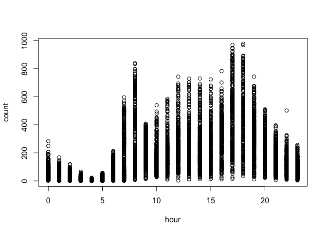
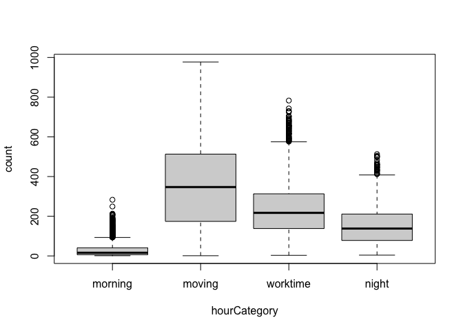
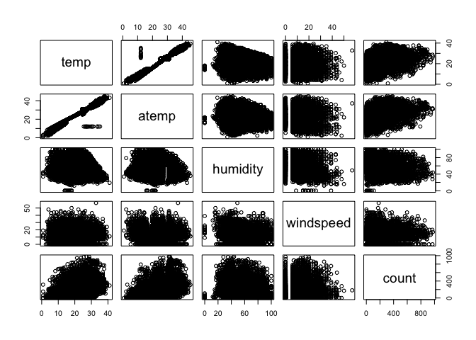
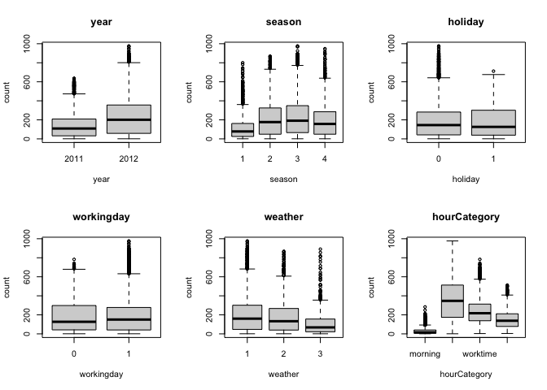
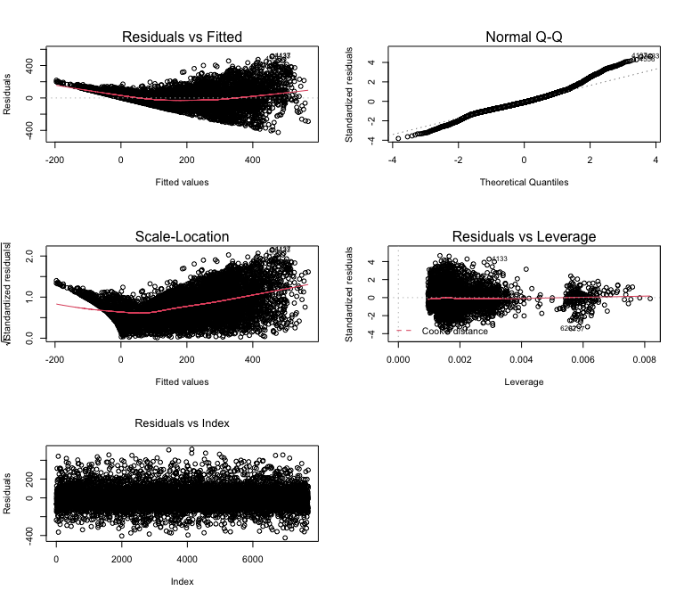
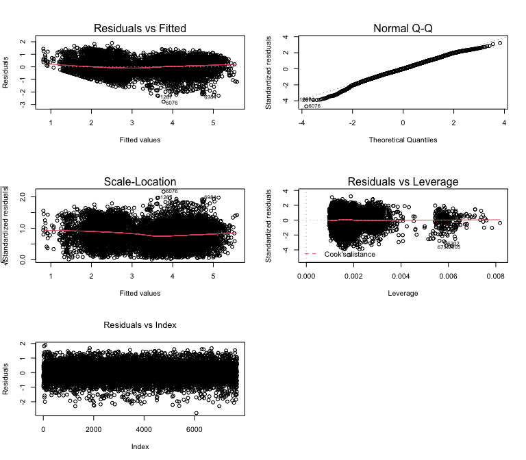
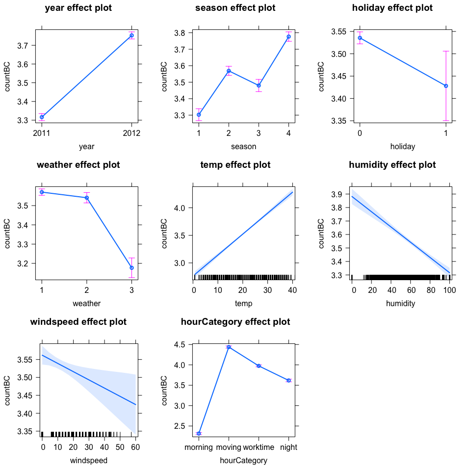
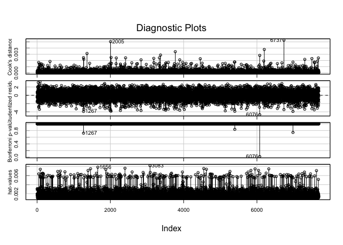

Práctica 1a (ML) - Estadística - Máster en Big Data
================

Víctor Juez, Arturo Menchaca

Noviembre 22, 2020

### Índice

  - [Conjunto de datos](#conjunto-de-datos)
  - [Análisis de las variables](#análisis-de-las-variables)
      - [Categorización de la variable
        hora](#categorización-de-la-variable-hora)
      - [Descriptiva de las variables
        numéricas](#descriptiva-de-las-variables-numéricas)
      - [Descriptiva de las variables
        categóricas](#descriptiva-de-las-variables-categóricas)
  - [Generación del modelo](#generación-del-modelo)
      - [Modelo 1 - Utilizando todas las
        variables](#modelo-1---utilizando-todas-las-variables)
      - [Modelo 2 - Selección automática de
        variables](#modelo-2---selección-automática-de-variables)
          - [Análisis de colinealidad de las
            variables](#análisis-de-colinealidad-de-las-variables)
          - [Validación de las premisas](#validación-de-las-premisas)
      - [Modelo 3 - Transformación de la variable
        resupesta](#modelo-3---transformación-de-la-variable-resupesta)
  - [Modelo final - Modelo 3](#modelo-final---modelo-3)
      - [Validación del modelo](#validación-del-modelo)
      - [Efecto de las características sobre la variable
        respuesta](#efecto-de-las-características-sobre-la-variable-respuesta)
  - [Anexo - Modelos descartados](#anexo---modelos-descartados)
      - [Modelo 4: Transformación
        polinómica](#modelo-4-transformación-polinómica)
      - [Modelo 5: Eliminar observaciones
        influyentes](#modelo-5-eliminar-observaciones-influyentes)

# Conjunto de datos

El conjunto de datos consta de las siguientes variables:

  - id: identificador de la franja horaria (no guarda relación con el
    orden temporal)
  - year: año (2011 o 2012)
  - hour: hora del día (0 a 23)
  - season: 1 = invierno, 2 =primavera, 3 = verano, 4 = otoño
  - holiday: si el día era festivo
  - workingday: si el día era laborable (ni festivo ni fin de semana)
  - weather: cuatro categorías (1 a 4) que van de mejor a peor tiempo
  - temp: temperatura en grados celsius
  - atemp: sensación de temperatura en grados celsius
  - humidity: humedad relativa
  - windspeed: velocidad del viento (km/h)
  - count (sólo en el conjunto de entrenamiento): número total de
    alquileres en esa franja

A continuación mostramos la descriptiva de los datos:

    ##    year           hour       season   holiday  workingday weather 
    ##  2011:3879   Min.   : 0.00   1:1901   0:7466   0:2481     1:5122  
    ##  2012:3810   1st Qu.: 6.00   2:1920   1: 223   1:5208     2:1981  
    ##              Median :12.00   3:1943                       3: 586  
    ##              Mean   :11.57   4:1925                               
    ##              3rd Qu.:18.00                                        
    ##              Max.   :23.00                                        
    ##       temp           atemp          humidity        windspeed     
    ##  Min.   : 0.82   Min.   : 0.76   Min.   :  0.00   Min.   : 0.000  
    ##  1st Qu.:13.94   1st Qu.:16.66   1st Qu.: 46.00   1st Qu.: 7.002  
    ##  Median :20.50   Median :24.24   Median : 62.00   Median :12.998  
    ##  Mean   :20.27   Mean   :23.70   Mean   : 61.77   Mean   :12.802  
    ##  3rd Qu.:26.24   3rd Qu.:31.06   3rd Qu.: 77.00   3rd Qu.:16.998  
    ##  Max.   :41.00   Max.   :45.45   Max.   :100.00   Max.   :56.997  
    ##      count      
    ##  Min.   :  1.0  
    ##  1st Qu.: 41.0  
    ##  Median :145.0  
    ##  Mean   :191.4  
    ##  3rd Qu.:283.0  
    ##  Max.   :977.0

# Análisis de las variables

## Categorización de la variable hora

Descriptiva de la variable respuesta en función de la variable hora:

<!-- -->

Decidimos agrupar la variable hora en los siguientes grupos:

  - Morning: de 0:00h a 6:00h
  - Moving: de 7:00h a 8:00h y de 17:00 a 19:00
  - Worktime: de 9:00h a 16:00h
  - Night: de 20:00h a 23:00h

A continuación la descriptiva de la variable hora categorizada:

<!-- -->

## Descriptiva de las variables numéricas

<!-- -->

Como podemos observar en la descriptiva que mostramos arriba, vemos que
la variable temp y atemp están muy relacionadas. Generamos un modelo
utilizando cada una de las variables por separado para ver cual de las
dos predice peor el resultado y eliminarla.

|           | Modelo utilizando `temp` | Modelo utilizando `atemp` |
| --------- | ------------------------ | ------------------------- |
| R-squared | 0.1578                   | 0.1537                    |

`temp` describe mejor el resultado (R-squared mayor), eliminamos la
variable `atemp`.

## Descriptiva de las variables categóricas

<!-- -->

Vemos que a primera vista parece que algunas categorías van a influir
más en la respuesta que otras. Las que tinen boxplots muy similares
entre categorías menos representativas van a ser, como es el caso de
`holiday` y `workingday`.

# Generación del modelo

## Modelo 1 - Utilizando todas las variables

  - Variables utilizadas: `year`, `season`, `holiday`, `workingday`,
    `weather`, `temp`, `humidity`, `windspeed` y `hourCategory`.

| Propiedad               | Valores    |
| ----------------------- | ---------- |
| Residual standard error | 111.3      |
| Multiple R-squared      | 0.6276     |
| p-value                 | \< 2.2e-16 |

## Modelo 2 - Selección automática de variables

Hemos utilizado el método matemático AIC (Akaike Information Criterion)
para determinar qué conjunto de variables es el óptimo para explicar el
modelo y cuales sería conveniente eliminar. Recordemos que cuanto menor
es el AIC mejor.

| Variable a eliminar | AIC eliminando la variable |
| ------------------- | -------------------------- |
| `workingday`        | 72472                      |
| `<ninguna>`         | 72473                      |
| `windspeed`         | 72474                      |
| `holiday`           | 72476                      |
| `weather`           | 72562                      |
| `humidity`          | 72664                      |
| `season`            | 72862                      |
| `temp`              | 73040                      |
| `year`              | 73501                      |
| `hourCategory`      | 77039                      |

Eliminamos la variable `workingday` y generamos otro modelo. A
continuación el resultado.

| Propiedad               | Valores    |
| ----------------------- | ---------- |
| Residual standard error | 111.3      |
| Multiple R-squared      | 0.6275     |
| p-value                 | \< 2.2e-16 |

  - Vemos un resultado prácticamente idéntico al del Modelo 1 pero
    utilizando una variable menos.

### Análisis de colinealidad de las variables

Utilizamos el indicador de VIF para analizar la colinealidad de las
variables restantes por si tuviéramos que eliminar alguna más. Buscamos
un valor de VIF \< 5.

| Variable     | VIF      |
| ------------ | -------- |
| year         | 1.025830 |
| season       | 3.169114 |
| holiday      | 1.003029 |
| weather      | 1.292185 |
| temp         | 3.083793 |
| humidity     | 1.684752 |
| windspeed    | 1.175091 |
| hourCategory | 1.319474 |

Podemos observar que el indicador VIF de todas las variables se mantiene
por debajo del 5, lo que nos indica que hay poca colinealidad entre las
variables y que no tendríamos que eliminar ninguna.

### Validación de las premisas

<!-- -->

  - **Homocedasticidad**: Vemos en el gráfico Residuals vs Fitted que no
    se cumple, la dispersión de los residuos no es constante y forman
    una efecto de embudo clara.
  - **Linealidad**: También en el gráfico de Residuals vs Fitted vemos
    que hay curvatura, tampoco se cumple.
  - **Normalidad de los residuos**: En el gráfico de Normal Q-Q vemos
    que hay desviación respecto la distribución normal tanto en valores
    pequeños como en grandes, por lo que no se cumple.
  - **Independencia**: Vemos en el gráfico Residuals vs Index que se
    cumple, la dispersión de los residuos a lo largo del orden en que
    aparecen en el conjunto de datos es constante.

## Modelo 3 - Transformación de la variable resupesta

Hemos generado dos nuevos modelos utilizando la transformación
logarítmica y la de BoxCox de la variable respuesta. A continuación los
resultados.

|                         | Transformación logarítmica | Transformación BoxCox |
| ----------------------- | -------------------------- | --------------------- |
| R-squared               | 0.7184                     | 0.7418                |
| Residual standard error | 0.7899                     | 0.5919                |

  - En general vemos una mejora sustancial utilizando una transformación
    en la variable respuesta, cualquiera de las dos.
  - De las dos transformaciones, nos quedamos con la de BoxCox ya que
    nos da un mejor resultado.

# Modelo final - Modelo 3

  - Variables utilizadas: `year, season, holiday, weather, temp,
    humidity, windspeed, hourCategory`

  - Transformaciones:
    
      - BoxCox en la variable respuesta
      - Categorización de la variable hora

  - Resultado:
    
    | Propiedes               | Valores    |  |
    | ----------------------- | ---------- |  |
    | Residual standard error | 0.5919     |  |
    | Multiple R-squared      | 0.7418     |  |
    | p-value                 | \< 2.2e-16 |  |
    

  - Expresión del modelo

<!-- end list -->

    ## 
    ## Call:
    ## lm(formula = countBC ~ year + season + holiday + weather + temp + 
    ##     humidity + windspeed + hourCategory, data = datos)
    ## 
    ## Residuals:
    ##     Min      1Q  Median      3Q     Max 
    ## -2.7752 -0.3683  0.0015  0.4019  1.8997 
    ## 
    ## Coefficients:
    ##                        Estimate Std. Error t value Pr(>|t|)    
    ## (Intercept)           1.5161674  0.0423634  35.790  < 2e-16 ***
    ## year2012              0.4364839  0.0136742  31.920  < 2e-16 ***
    ## season2               0.2660031  0.0250530  10.618  < 2e-16 ***
    ## season3               0.1770850  0.0320088   5.532 3.26e-08 ***
    ## season4               0.4738698  0.0208005  22.782  < 2e-16 ***
    ## holiday1             -0.1075865  0.0402854  -2.671  0.00759 ** 
    ## weather2             -0.0291989  0.0167442  -1.744  0.08123 .  
    ## weather3             -0.3931704  0.0281752 -13.954  < 2e-16 ***
    ## temp                  0.0380311  0.0015152  25.100  < 2e-16 ***
    ## humidity             -0.0056539  0.0004540 -12.455  < 2e-16 ***
    ## windspeed            -0.0022970  0.0008947  -2.567  0.01027 *  
    ## hourCategorymoving    2.1240396  0.0203887 104.177  < 2e-16 ***
    ## hourCategoryworktime  1.6613631  0.0195673  84.905  < 2e-16 ***
    ## hourCategorynight     1.3035639  0.0211916  61.513  < 2e-16 ***
    ## ---
    ## Signif. codes:  0 '***' 0.001 '**' 0.01 '*' 0.05 '.' 0.1 ' ' 1
    ## 
    ## Residual standard error: 0.5919 on 7675 degrees of freedom
    ## Multiple R-squared:  0.7418, Adjusted R-squared:  0.7413 
    ## F-statistic:  1696 on 13 and 7675 DF,  p-value: < 2.2e-16

## Validación del modelo

<!-- -->

  - **Homocedasticidad**: Se cumple, sigue habiendo más dispersión en el
    centro y en valores más altos que en pequeños, pero ya no tenemos la
    forma de embudo tan destacada que teníamos en el Modelo 2.
  - **Linealidad**: Se cumple, hay curvatura pero muy leve.
  - **Normalidad de los residuos**: Sigue desviándose en valores altos
    pero podríamos considerar que ahora se cumple, ha mejorado respecto
    al Modelo 2.
  - **Independencia**: Se cumple, igual que en el Modelo 2.

## Efecto de las características sobre la variable respuesta

<!-- -->

# Anexo - Modelos descartados

## Modelo 4: Transformación polinómica

Hemos realizado una transformación polinómica a las variables numéricas
y generado un nuevo modelo con ellas. Vemos el resultado a continuación.

  - Modelo de referencia: Modelo 3

  - Transformación añadida: Transformación polinómica de las variables
    `temp`, `humidity` y `windspeed`

  - Resultado:
    
    | Propiedes               | Valores    |
    | ----------------------- | ---------- |
    | Residual standard error | 0.5884     |
    | Multiple R-squared      | 0.7449     |
    | p-value                 | \< 2.2e-16 |
    

  - Vemos que hay una diferencia insignificante respecto al Modelo 3,
    por lo que no vemos que sea necesario utilizar la transformación
    polinómica

## Modelo 5: Eliminar observaciones influyentes

Analizamos las observaciones influyentes del Modelo 3:

<!-- -->

Vemos que las observaciones 2005 y 6737 son las que tienen una distancia
de Cook mayor, por lo que son las más influyentes. A continuación sus
distancias de Cook respectivas:

| Observación | Distancia de Cook |
| ----------- | ----------------- |
| 2005        | 0.0050            |
| 6737        | 0.0052            |

Eliminamos estas dos observaciones y generamos un nuevo modelo.

  - Modelo de referencia: Modelo 3

  - Transformación añadida: Eliminación de las observaciones influyentes
    2005 y 6737

  - Resultado:
    
    | Propiedes               | Valores    |
    | ----------------------- | ---------- |
    | Residual standard error | 0.5911     |
    | Multiple R-squared      | 0.7425     |
    | p-value                 | \< 2.2e-16 |
    

  - De nuevo, la diferencia es insignificante respecto el Modelo 3, por
    lo que no interesa hacer esta transformación
