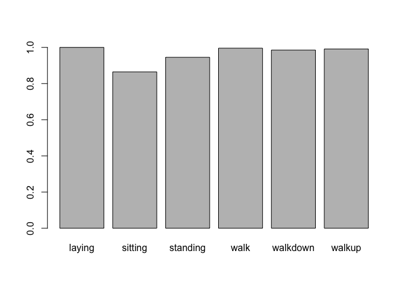

MBD - Estadística - Práctica II (Clustering)
================

Víctor Juez

Diciembre 2020

-   Enunciado: [practica-2.pdf](./practica-2.pdf)
-   Script resultado: [script.R](./script.R)

# Introducción

Actualmente, los teléfonos móviles almacenan una gran cantidad de datos
en tiempo real sobre nuestras actividades rutinarias. Entre otros
parámetros recogen información de nuestra movilidad gracias a sensores
integrados dentro del mismo dispositivo. La compañía de teléfonos
móviles SAMSAPPLE quiere clasificar la actividad de los usuarios de sus
dispositivos en 6 niveles en base a la información recibida en tiempo
real. Aunque es un problema que tienen bastante resuelto, han realizado
un experimento con 21 voluntarios, los cuales reportaban en cada
instante su estado real de actividad categorizado en 6 niveles: tumbado
(laying); sentado (sitting); de pie (standing); caminando (walk);
bajando escaleras (walkdown); o subiendo (walkup).

## Objetivo

1.  Agrupar las distintas respuestas de los sensores procurando mantener
    las máximas similitudes entre clústeres y la máxima heterogeneidad
    entre los mismos para discernir el número de tipos de actividades
    posibles (=número de grupos). Para llevarlo a cabo, se usará la
    técnica de clustering no supervisado del k-means. Sólo usar los
    datos de entrenamiento sin usar variable respuesta para hallar el
    número de grupos.

2.  Construir un modelo predictivo que sea capaz de clasificar los
    individuos en cada instante en una de las 6 categorías de actividad.
    Para realizar la predicción sobre los datos de test, se deberán usar
    algunos (o preferentemente todos) los algoritmos vistos en las
    sesiones: KNN, Naive Bayes, Conditional Trees, Random Forests y SVM.
    Usar datos de entrenamiento para construir el modelo y hacer las
    predicciones sobre el conjunto de test

# Parte I. Clustering no supervisado

Para identificar el número de clústers hemos utilizado el K-means.
Sabemos que en el conjunto de datos final hay 6 categorías de actividad
diferentes, así que, lo ideal sería identificar 6 clústers en el
conjunto de datos. Para ello hemos utilizado por un lado el método de la
regla del codo y por otro, la librería NbClust que utilizando diferentes
índices determina cual es el número de clústeres ideal.

## 1. Regla del codo

Ejecutamos el k-means 10 veces utilizando de 1 a 10 clústeres
respectivamente, y por cada resultado comparamos la variabilidad
explicada.

<!-- -->

Como podemos observar, según la regla del codo nos quedamos con dos
clústers, ya que, es en este punto donde se forma el codo y, a partir de
dos para arriba, el incremento de variabilidad explicada es muy pequeño.
A continuación podemos observar la variabilidad explicada por cada
número de clústers.

| Num. Clusters | Variabilidad explicada |
|---------------|------------------------|
| 1             | 0.00                   |
| 2             | 0.57                   |
| 3             | 0.61                   |
| 4             | 0.64                   |
| 5             | 0.66                   |
| 6             | 0.67                   |
| 7             | 0.68                   |
| 8             | 0.69                   |
| 9             | 0.70                   |
| 10            | 0.70                   |

Aunque la variabilidad explicada sí que va aumentando a medida que se
incrementan el número de clústers, vemos que el incremento más grande se
produce cuando se pasa de un clúster a dos.

## 2. NbClust

La librería NbClust utiliza 30 índices diferentes variando por cada uno
todas las combinaciones de número de clústers, tipo de distancias y
métodos de clusterización para determinar el número de clústers que más
encaja al conjunto de datos.

El coste computacional de esta operción es bastante elevado, y por este
motivo hemos reducido la dimensionalidad del conjunto de datos de la
siguiente manera:

-   **Principal Component Analysis (PCA)**: Nos hemos quedado con las 10
    componentes principales en vez de utilizar las más de 500
    características que hay en el conjunto de datos.
-   **Reducción de observaciones**: Hemos utilzado 500 observaciones en
    vez de las aproximadamente 5000 que hay en el conjunto de datos.

El resultado obtenido tras la ejecución es el siguiente:

<!-- -->

Por mayoría, el mejor número de clústers es 2, apoyado por 12 índices.

## 3. Representación gráfica y análisis del resultado

Utilizando el mismo Principal Component Analysis (PCA) que hemos
realizado anteriormente, hemos extraído los dos componentes más
significativos. Éstos van a formar el eje X e Y respectivamente, y sobre
ellos mostramos el conjunto de datos marcados con colores distintos para
representar el clúster al que pertenecen.

<!-- -->

Vemos que la partición en dos clústers es coherente y que a simple vista
no se identifican más que éstos dos. Esto nos indica que utilizando el
conjunto de datos de muestra, no podemos discernir con presición entre
las 6 actividades diferentes. Por este mismo motivo, observamos que la
variabilidad explicada utilizando únicamente dos clústers es de 0.57, un
valor bajo, y es que estamos dejando de identificar 4 categorías.

# Parte II. Clustering supervisado

Hemos dividio el conjunto de datos en dos muestras:

-   Muestra de entrenamiento, para entrenar los modelos. Representa un
    70% del conjunto de datos
-   Muestra de test, para analizar el rendimiento de los distintos
    algoritmos que utilizaremos. Representa un 30% del conjunto de
    datos.

## 1. K-Nearest Neighbor

### Buscar la K óptima

Primero, ejecutamos el algoritmo utilizando diferentes valores de (`K`)
para encontrar el que mejor se ajusta.

<!-- -->

Vemos que `K = 3` es el que mejor resultado da, con un `0.9622016` de
capacidad predictiva.

### Usar la K óptima

``` r
knn <- knn(train[,-ncol(d)], test=test[,-ncol(d)], cl=train$activity, k = 3)
```

-   Matriz de confusión:

<!-- -->

    ##           
    ## knn        laying sitting standing walk walkdown walkup
    ##   laying      297       0        0    0        0      0
    ##   sitting       0     230       15    0        0      0
    ##   standing      0      36      259    0        0      0
    ##   walk          0       0        0  234        1      1
    ##   walkdown      0       0        0    0      201      1
    ##   walkup        0       0        0    1        2    230

-   Capacidad predictiva: `0.9622016`.
-   Capacidad predictiva por clase:

<!-- -->

A continuación hay dos variantes que probamos para intentar mejorar el
resultado sin éxito.

### Variante 1. ACP previo a KNN

Reducimos la dimensionalidad del conjunto de datos previo a ejecutar el
KNN y cogemos las primeras 10 componentes principales.

``` r
res.acp <- pr.comp$scores[,1:50]
train2 <- res.acp[train.sel,]
test2 <- res.acp[!train.sel,]

K <- seq(1,21,2)
p <- c()
for(k in K){
  knn <- knn(train2, test2, cl=train$activity, k = k)
  t <- table(knn,test$activity)
  p <- c(p,sum(diag(t))/sum(t))
}
plot(K,p,pch=19,type='b')
```

<!-- -->

Mejor resultado con `K = 7` que da un `0.9429708` de capacidad
predictiva. No mejora.

### Variante 2. Kernel KNN

``` r
p <- c()
K <- seq(1,21,2)
for(k in K){
  kknn <- kknn(factor(activity)~., train, test,k=k)
  t <- table(fitted(kknn),test$activity)
  p <- c(p,sum(diag(t))/sum(t))
}
plot(K,p,pch=19,type='b')
```

<!-- -->

Mejor resultado con `K = 15` que da un `0.9522546` de capacidad
predictiva. No mejora.

## 2. Naive Bayes

``` r
nb <- naiveBayes(activity ~ ., train)
```

-   Matriz de confusión:

<!-- -->

    ##           
    ## preds      laying sitting standing walk walkdown walkup
    ##   laying      287       3        0    0        0      0
    ##   sitting       9     138        9    0        0      0
    ##   standing      0     123      261    0        0      0
    ##   walk          0       0        0  160        8      8
    ##   walkdown      0       0        0   34      161     21
    ##   walkup        1       2        4   41       35    203

-   Capacidad predictiva: `0.8023873`. Inferior al KNN.
-   Capacidad predictiva por clase:

<!-- -->

Vemos un resultado peor que en el KNN, sobretodo en la predicción de la
clase `sitting`.

## 3. Árboles condicionales

``` r
ct.mod <- ctree(activity ~ ., train)                                  
```

-   Matriz de confusión:

<!-- -->

    ##           
    ## pred       laying sitting standing walk walkdown walkup
    ##   laying      296       0        0    0        0      0
    ##   sitting       1     236       40    0        0      0
    ##   standing      0      30      233    0        0      0
    ##   walk          0       0        1  206       16     23
    ##   walkdown      0       0        0   17      179     19
    ##   walkup        0       0        0   12        9    190

-   Capacidad predictiva global: `0.9124668`
-   Capacidad predictiva por clase:

<!-- -->

## 4. Random Forest

``` r
rf.mod <- randomForest(activity~.,train,importance=TRUE,ntree=100,do.trace=TRUE)  
```

-   Parámetros especificados:
    -   `importance=TRUE`: para que considere la importancia de los
        predictores.
    -   `ntree=100`: número de árboles generados.
    -   `do.trace=TRUE`: emite más “logs” para tener más información de
        la ejecución del algoritmo.
-   Resultado del algoritmo:
    -   Variables utilizadas por cada árbol generado: 23
    -   Out-of-bag error estimado: 3.52%
-   Matriz de confusión:

<!-- -->

    ##           
    ## pred.rf    laying sitting standing walk walkdown walkup
    ##   laying      297       0        0    0        0      0
    ##   sitting       0     250       26    0        0      0
    ##   standing      0      16      248    0        0      0
    ##   walk          0       0        0  229        3      5
    ##   walkdown      0       0        0    2      198      1
    ##   walkup        0       0        0    4        3    226

-   Capacidad predictiva global: `0.9602122`
-   Capacidad predictiva por clase:

<!-- -->

Validamos que no necesitamos generar más árboles:

<!-- -->

Vemos que los errores estan estabilizados tras 100 árboles generados,
por lo que utilizar más no cambiaría el resultado.

### Variante 1. Valor MTRY óptimo

Buscamos el valor óptimo de `mtry`, el cual especifica la cantidad de
variables a utilizar por cada árbol que se genera.

<!-- -->

Dado el gráfico resultante, `mtry = 92` es el óptimo. Volvemos a
ejecutar el Random Forest con este parámetro especificado.

``` r
rf.mod1 <- randomForest(activity~.,train,importance=TRUE,ntree=100,do.trace=TRUE,mtry=92)
```

-   Parámetros especificados: los mismos que antes pero añadiendo el
    `mtry`.
-   Matriz de confusión:

<!-- -->

    ##           
    ## pred.rf1   laying sitting standing walk walkdown walkup
    ##   laying      297       0        0    0        0      0
    ##   sitting       0     248       34    0        0      0
    ##   standing      0      18      240    0        0      0
    ##   walk          0       0        0  224        5      4
    ##   walkdown      0       0        0    3      196      3
    ##   walkup        0       0        0    8        3    225

-   Capacidad predictiva global: `0.9502653`. No mejora

## 5. Support Vector Machines (SVM)

### Buscar parámetros óptimos

En primer lugar, buscamos qué combinación de los siguientes parámetros
nos da mejor resultado con el algoritmo. Los valores a probar son:

-   Kernel: `linear, polynomial, radial, sigmod`.
-   Coste: `0.01, 0.2, 0.1, 1, 5, 10, 100`.

Para hacerlo, usamos la función `tune()`, la cual en todas las
ejecuciones aplica un `Cross Validation (10-fold)`, por lo que no
tenemos que utilizar las particiones `train` y `test`, y en cambio,
podemos utilizar todo el conjunto de datos directamente.

Cabe mencionar que dado el alto coste computacional de esta operación,
volvemos a hacer una reducción de dimensionaliad de los datos.
Utilizamos el `Principal Component Analysis (PCA)` realizado
anteriormente.

-   Nos quedamos los 10 primeros componentes en vez de las más de 500
    características presentes en el conjunto de datos.
-   Mantenemos el mismo número de muestras.

``` r
# Reducción de dimensionalidad
pr.comp = princomp(d[,-ncol(d)])
d2 = as.data.frame(pr.comp$scores[,1:10])
d2$activity = d$activity[1:nrow(d2)]

# SVM
mod.tune <- tune(svm,activity~.,
                  data = d2,
                  ranges = list(kernel = c('linear','polynomial','radial','sigmoid'),
                                cost = c(0.01,0.2,0.1,1,5,10,100)))
```

``` r
mod.tune$best.parameters
```

    ##    kernel cost
    ## 23 radial   10

De todas las combinaciones, `kernel = radial` y `cost = 10` es la que
mejor resultado nos da, con un error de `0.0844`.

### Usar los parámetros óptimos

Ahora que tenemos los parámetros óptimos ejecutamos el SVM utilizando
las muestras `train` y `test` y sin reducir su dimensionalidad.

``` r
mod.svm <- svm(activity~.,data = train, cost=10, kernel='radial')
```

-   Matriz de confusión

<!-- -->

    ##           
    ## pr         laying sitting standing walk walkdown walkup
    ##   laying      297       1        0    0        0      0
    ##   sitting       0     253       14    0        0      0
    ##   standing      0      12      260    0        0      0
    ##   walk          0       0        0  235        0      1
    ##   walkdown      0       0        0    0      204      2
    ##   walkup        0       0        0    0        0    229

-   Capacidad predictiva global: `0.9801061`.
-   Capacidad predictiva por clase:

<!-- -->

## Tabla de resultados y predicción final

| Algoritmo            | Capacidad predictiva |
|----------------------|----------------------|
| KNN                  | 0.9622016            |
| ACP + KNN            | 0.9429708            |
| KKNN                 | 0.9522546            |
| Naive Bayes          | 0.8023873            |
| Conditional Trees    | 0.9124668            |
| Random Forest        | 0.9602122            |
| Random Forest + MTRY | 0.9502653            |
| SVM                  | 0.9801061            |

Dado que el SVM ha sido el algoritmo con el que mayor capacidad
predictiva hemos obtenido, es el que hemos utilizado para realizar la
predicción final:

-   Algoritmo: SVM
-   Parámetros:
    -   `cost = 10`
    -   `kernel = radial`
