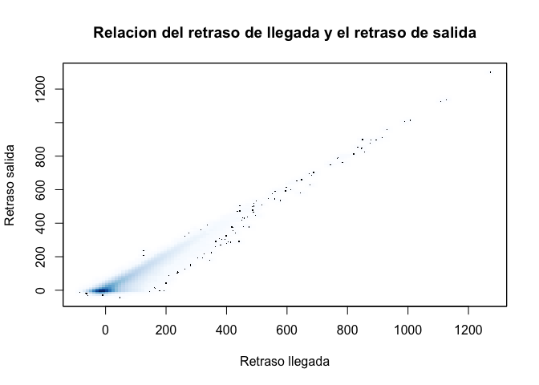
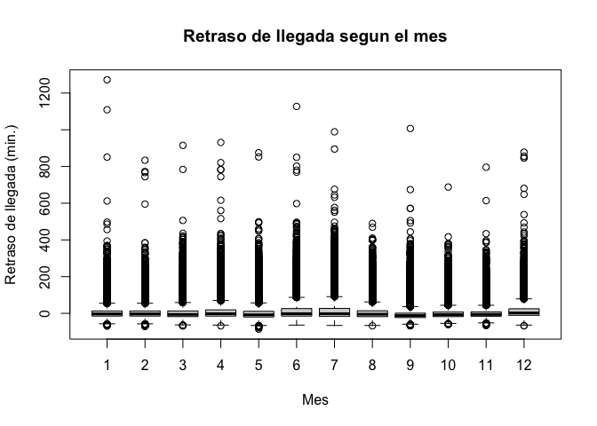

MUBD - Estadistica - Sesion 1
================

## Ejercicio 1.1

1.  Crear un data.frame con los siguientes datos

| Marca     | Modelo | Consumo |
| --------- | ------ | ------- |
| audi      | A3     | 6.8     |
| volswagen | Polo   | 6.8     |
| bmw       | X5     | 12.5    |
| renault   | megane | 4.7     |
| fiat      | punto  | 5.0     |

2.  Modificar el consumo del fiat punto a 4.5

<!-- end list -->

``` r
#1
marcas <- c("audi","volkswagen","bmw", "renault", "fiat")
modelos <- c("A3", "Polo", "X5", "megane", "punto")
consumos <- c(6.8, 6.8, 12.5, 4.7, 5.0)
df1 <- data.frame(marcas, modelos, consumos)

#2
df1$consumos[5] <- 4.5
df1
```

<details>

<summary>Result</summary>

<p>

    ##       marcas modelos consumos
    ## 1       audi      A3      6.8
    ## 2 volkswagen    Polo      6.8
    ## 3        bmw      X5     12.5
    ## 4    renault  megane      4.7
    ## 5       fiat   punto      4.5

</p>

</details>

## Ejercicio 1.2

1.  Leer el fichero flights.txt cambiando los parametros de lectura
    oportunos y guardar en datos2 (OJO con el simbolo de los missings)
2.  Inspeccionar los datos: num. filas y columnas, visualizar los datos
    y descriptiva global
3.  ¿Cuanto tiempo estuvo en el aire el vuelo 251 y con numero de cola
    N855UA?

<!-- end list -->

``` r
#1
datos2 = read.table('flights.txt',header=TRUE,sep='\t',dec = '.', na.strings = "@", stringsAsFactors = TRUE)
```

``` r
#2
dim(datos2)
# View(datos2) # No se ejecuta porque el resultado es  demasiado grande para imprimirlo en el informe
summary(datos2)

#3
sel.flight = which(datos2$flight==251 & datos2$tailnum=="N855UA")
datos2[sel.flight, "air_time"]
```

<details>

<summary>Result</summary>

<p>

    ## [1] 336776     16

    ##       year          month             day           dep_time   
    ##  Min.   :2013   Min.   : 1.000   Min.   : 1.00   Min.   :   1  
    ##  1st Qu.:2013   1st Qu.: 4.000   1st Qu.: 8.00   1st Qu.: 907  
    ##  Median :2013   Median : 7.000   Median :16.00   Median :1401  
    ##  Mean   :2013   Mean   : 6.549   Mean   :15.71   Mean   :1349  
    ##  3rd Qu.:2013   3rd Qu.:10.000   3rd Qu.:23.00   3rd Qu.:1744  
    ##  Max.   :2013   Max.   :12.000   Max.   :31.00   Max.   :2400  
    ##                                                  NA's   :8255  
    ##    dep_delay          arr_time      arr_delay           carrier     
    ##  Min.   : -43.00   Min.   :   1   Min.   : -86.000   UA     :58665  
    ##  1st Qu.:  -5.00   1st Qu.:1104   1st Qu.: -17.000   B6     :54635  
    ##  Median :  -2.00   Median :1535   Median :  -5.000   EV     :54173  
    ##  Mean   :  12.64   Mean   :1502   Mean   :   6.895   DL     :48110  
    ##  3rd Qu.:  11.00   3rd Qu.:1940   3rd Qu.:  14.000   AA     :32729  
    ##  Max.   :1301.00   Max.   :2400   Max.   :1272.000   MQ     :26397  
    ##  NA's   :8255      NA's   :8713   NA's   :9430       (Other):62067  
    ##     tailnum           flight     origin            dest           air_time    
    ##         :  2512   Min.   :   1   EWR:120835   ORD    : 17283   Min.   : 20.0  
    ##  N725MQ :   575   1st Qu.: 553   JFK:111279   ATL    : 17215   1st Qu.: 82.0  
    ##  N722MQ :   513   Median :1496   LGA:104662   LAX    : 16174   Median :129.0  
    ##  N723MQ :   507   Mean   :1972                BOS    : 15508   Mean   :150.7  
    ##  N711MQ :   486   3rd Qu.:3465                MCO    : 14082   3rd Qu.:192.0  
    ##  N713MQ :   483   Max.   :8500                CLT    : 14064   Max.   :695.0  
    ##  (Other):331700                               (Other):242450   NA's   :9430   
    ##     distance         hour           minute     
    ##  Min.   :  17   Min.   : 0.00   Min.   : 0.00  
    ##  1st Qu.: 502   1st Qu.: 9.00   1st Qu.:16.00  
    ##  Median : 872   Median :14.00   Median :31.00  
    ##  Mean   :1040   Mean   :13.17   Mean   :31.76  
    ##  3rd Qu.:1389   3rd Qu.:17.00   3rd Qu.:49.00  
    ##  Max.   :4983   Max.   :24.00   Max.   :59.00  
    ##                 NA's   :8255    NA's   :8255

    ## [1] 246

</p>

</details>

## Ejercicio 1.3

1.  Copiar los vuelos que estuvieron volando menos de 1 hora en un
    fichero llamado short\_flights\_test.txt \[El fichero sin usar
    comillas para las categorias,sin nombre de columnas ni de filas y
    columnas separadas por tabuladores\]

<!-- end list -->

``` r
datos <- read.table('Mobiles.txt',header=TRUE,sep=";",dec=".",na.strings=c("NA",""), stringsAsFactors = TRUE) 
write.table(subset(datos,air_time < 60), "Flights_test.txt", quote=FALSE, row.names = FALSE, sep = "\t")
```

## Ejercicio 1.4

1.  Realiza la descriptiva de la variable tiempo de vuelo (air\_time)
    del conjunto de datos flights.txt
2.  Realiza la descriptiva de la variable categorica origen (origin) del
    conjunto de datos flights.txt

<!-- end list -->

``` r
#1
summary(datos2$air_time)
sd(datos2$air_time,na.rm=TRUE)
```

<details>

<summary>Result</summary>

<p>

    ##    Min. 1st Qu.  Median    Mean 3rd Qu.    Max.    NA's 
    ##    20.0    82.0   129.0   150.7   192.0   695.0    9430

    ## [1] 93.6883

</p>

</details>

``` r
hist(datos2$air_time, col="blue")
boxplot(datos2$air_time, main="Air time (minutes)")
```

<details>

<summary>Result</summary>

<p>

<!-- --><!-- -->

</p>

</details>

``` r
#2
originTable = table(datos2$origin)      # Tabla de frecuencias
prop.table(originTable)                 # Tabla proporciones
round(100*prop.table(originTable),1)    # Tabla de proporciones redondeados
```

<details>

<summary>Result</summary>

<p>

    ## 
    ##       EWR       JFK       LGA 
    ## 0.3587993 0.3304244 0.3107763

    ## 
    ##  EWR  JFK  LGA 
    ## 35.9 33.0 31.1

</p>

</details>

## Ejercicio 1.5

1.  Realiza la descriptiva del retraso en la llegada segun el retraso en
    la salida.
2.  Calcula la correlacion y haz el diagrama bivariante. Tambien usa la
    instruccion smoothScatter para hacer un plot alternativo

<!-- end list -->

``` r
#1
#- Descriptiva global de cada variable (previo al ejercicio, no necesario)
summary(datos2$arr_delay)
summary(datos2$dep_delay)
```

<details>

<summary>Result</summary>

<p>

    ##     Min.  1st Qu.   Median     Mean  3rd Qu.     Max.     NA's 
    ##  -86.000  -17.000   -5.000    6.895   14.000 1272.000     9430

    ##    Min. 1st Qu.  Median    Mean 3rd Qu.    Max.    NA's 
    ##  -43.00   -5.00   -2.00   12.64   11.00 1301.00    8255

</p>

</details>

``` r
#- Correlacion entre las variables
cor(datos2$arr_delay, datos2$dep_delay, use="complete.obs")
```

<details>

<summary>Result</summary>

<p>

    ## [1] 0.9148028

*0.91 -\> observamos que hay una relacion directa (\>1) y con alta
intensidad (muy cerca del 1)*

</p>

</details>

``` r
#- Diagrama bivariante 
smoothScatter(datos2$arr_delay, 
              datos2$dep_delay, 
              xlab="Retraso llegada", 
              ylab="Retraso salida", 
              main="Relacion del retraso de llegada y el retraso de salida")  # Grafico bivariante
```

<details>

<summary>Result</summary>

<p>

<!-- -->

</p>

</details>

3.  Realiza la descriptiva del retraso en la llegada segun el mes del
    a?o
4.  Haz el summary del retraso segun el mes y el boxplot estratificado

<!-- end list -->

``` r
# Analisi de variables
  # arr_delay: variable Numerica Continua
  # month: variable Categorica Ordinal?

tapply(datos2$arr_delay, datos2$month, summary)
```

<details>

<summary>Result</summary>

<p>

    ## $`1`
    ##    Min. 1st Qu.  Median    Mean 3rd Qu.    Max.    NA's 
    ##  -70.00  -15.00   -3.00    6.13   13.00 1272.00     606 
    ## 
    ## $`2`
    ##    Min. 1st Qu.  Median    Mean 3rd Qu.    Max.    NA's 
    ## -70.000 -15.000  -3.000   5.613  13.000 834.000    1340 
    ## 
    ## $`3`
    ##    Min. 1st Qu.  Median    Mean 3rd Qu.    Max.    NA's 
    ## -68.000 -18.000  -6.000   5.808  13.000 915.000     932 
    ## 
    ## $`4`
    ##    Min. 1st Qu.  Median    Mean 3rd Qu.    Max.    NA's 
    ##  -68.00  -15.00   -2.00   11.18   19.00  931.00     766 
    ## 
    ## $`5`
    ##    Min. 1st Qu.  Median    Mean 3rd Qu.    Max.    NA's 
    ## -86.000 -20.000  -8.000   3.522  11.000 875.000     668 
    ## 
    ## $`6`
    ##    Min. 1st Qu.  Median    Mean 3rd Qu.    Max.    NA's 
    ##  -64.00  -15.00   -2.00   16.48   26.00 1127.00    1168 
    ## 
    ## $`7`
    ##    Min. 1st Qu.  Median    Mean 3rd Qu.    Max.    NA's 
    ##  -66.00  -16.00   -2.00   16.71   27.00  989.00    1132 
    ## 
    ## $`8`
    ##    Min. 1st Qu.  Median    Mean 3rd Qu.    Max.    NA's 
    ## -68.000 -18.000  -5.000   6.041  14.000 490.000     571 
    ## 
    ## $`9`
    ##     Min.  1st Qu.   Median     Mean  3rd Qu.     Max.     NA's 
    ##  -68.000  -23.000  -12.000   -4.018    1.000 1007.000      564 
    ## 
    ## $`10`
    ##     Min.  1st Qu.   Median     Mean  3rd Qu.     Max.     NA's 
    ## -61.0000 -18.0000  -7.0000  -0.1671   7.0000 688.0000      271 
    ## 
    ## $`11`
    ##     Min.  1st Qu.   Median     Mean  3rd Qu.     Max.     NA's 
    ## -67.0000 -16.0000  -6.0000   0.4613   8.0000 796.0000      297 
    ## 
    ## $`12`
    ##    Min. 1st Qu.  Median    Mean 3rd Qu.    Max.    NA's 
    ##  -68.00  -11.00    2.00   14.87   25.00  878.00    1115

</p>

</details>

``` r
boxplot(datos2$arr_delay~datos2$month, 
        xlab="Mes",
        ylab="Retraso de llegada (min.)",
        main="Retraso de llegada segun el mes")
```

<details>

<summary>Result</summary>

<p>

<!-- -->

</p>

</details>
