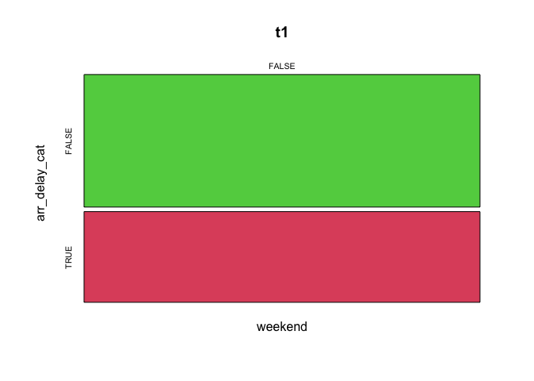

MUBD - Estadistica - Sesion 2
================

  - Documentación:
    [MUBD-1.2.Descriptiva-con-R.pdf](./MUBD-1.2.Descriptiva-con-R.pdf) -
    [MUBD-2.1.Inferencia-Estadistica\_summary.pdf](./MUBD-2.1.Inferencia-Estadistica_summary.pdf)

### Table of Contents

  - [Lectura de datos](#lectura-de-datos)
  - [Estimacion de la media
    poblacional](#estimacion-de-la-media-poblacional)
  - [Estimacion de la desviacion
    poblacional](#estimacion-de-la-desviacion-poblacional)
      - [Se cumple la normalidad?](#se-cumple-la-normalidad)
      - [Alternativa: bootstrap](#alternativa-bootstrap)
  - [Estimacion de una proporcion](#estimacion-de-una-proporcion)
  - [Ejercicios](#ejercicios)
      - [Ejercicio 2.1](#ejercicio-21)
      - [Ejercicio 2.2](#ejercicio-22)
      - [Ejercicio 2.3](#ejercicio-23)
      - [Ejercicio 2.4](#ejercicio-24)
      - [Ejercicio 2.5](#ejercicio-25)

## Lectura de datos

``` r
datos <- read.table('Mobiles.txt',header=TRUE,sep=";",dec=".",na.strings=c("NA",""))
```

## Estimacion de la media poblacional

``` r
summary(datos$Bill)      # Descriptiva de los datos numerica
```

    ##    Min. 1st Qu.  Median    Mean 3rd Qu.    Max.    NA's 
    ##    0.00   25.00   35.00   46.85   60.00  300.00       5

``` r
hist(datos$Bill)         # Descriptiva de los datos grafica
```

<!-- -->

``` r
t.test(datos$Bill)       # Estimacion de la media con su IC y hipotesis de que la media es 0 (por defecto)
```

    ## 
    ##  One Sample t-test
    ## 
    ## data:  datos$Bill
    ## t = 14.864, df = 173, p-value < 2.2e-16
    ## alternative hypothesis: true mean is not equal to 0
    ## 95 percent confidence interval:
    ##  40.62927 53.07188
    ## sample estimates:
    ## mean of x 
    ##  46.85057

``` r
t.test(datos$Bill,mu=50) # Hipotesis de que la media poblacional es 50
```

    ## 
    ##  One Sample t-test
    ## 
    ## data:  datos$Bill
    ## t = -0.99919, df = 173, p-value = 0.3191
    ## alternative hypothesis: true mean is not equal to 50
    ## 95 percent confidence interval:
    ##  40.62927 53.07188
    ## sample estimates:
    ## mean of x 
    ##  46.85057

## Estimacion de la desviacion poblacional

``` r
##-- Usando formula ya que no hay una funcion en el paquete base que lo calcule
##-- Formula: ver diapositiva   
s2 <- var(datos$Bill,na.rm=TRUE)         # varianza de las facturas
n <- sum(!is.na(datos$Bill))             # tama?o muestral. Valores que no son missings
chi2 <- qchisq(0.025,n-1)                # cuantil 0.025 de una chi-cuadrado con (n-1) grados de libertad
chi1 <- qchisq(0.975,n-1)                # cuantil 0.975 de una chi-cuadrado con (n-1) grados de libertad
(LI <- (n-1)*s2/chi1)                    # Limite inferior del IC de la varianza
```

    ## [1] 1415.264

``` r
(LS <- (n-1)*s2/chi2)                    # Limite superior del IC de la varianza  
```

    ## [1] 2159.742

``` r
sqrt(c(LI,LS))                           # IC para la desviacion tipica (sqrt = raiz cuadrada)
```

    ## [1] 37.62000 46.47302

### Se cumple la normalidad?

``` r
##-- ?Se cumple la Normalidad de los datos? --> No se cumple
qqnorm(datos$Bill)                       # Distribucion empirica vs teorica
qqline(datos$Bill,col=2)                 # Los puntos al no situarse sobre la linea, no son Normales
```

<!-- -->

### Alternativa: bootstrap

``` r
##-- Alternativa: bootstrap
##-- Generamos 10000 muestras de la muestra original con reposicion
set.seed(12345)                                                        # Se fija una semilla para que todas las simulaciones sean iguales
m <- replicate(10000, sd(sample(datos$Bill, replace=TRUE),na.rm=TRUE)) # Se generan 10000 muestras y para cada una de ellas se calcula la desviacion
hist(m)                                                                # Histograma de las desviaciones 
```

<!-- -->

``` r
quantile(m,probs=c(0.025, 0.975))                                      # Se calcula el IC95% cogiendo los cuantiles 0.025 y 0.975
```

    ##     2.5%    97.5% 
    ## 30.22804 52.50467

## Estimacion de una proporcion

``` r
##-- Probabilidad de que un estudiante tenga una tarjeta prepago
(e <- sum(datos$PlanType=='Prepaid',na.rm=TRUE)) # Numero de estudiantes con tarjeta prepago
```

    ## [1] 98

``` r
(n <- sum(!is.na(datos$PlanType)))               # Numero de estudiantes totales que no tienen missing esta variable (OJO: no n <- length(datos$PlanType))
```

    ## [1] 174

``` r
prop.test(e,n)                                   # Estimacion de una probabilidad
```

    ## 
    ##  1-sample proportions test with continuity correction
    ## 
    ## data:  e out of n, null probability 0.5
    ## X-squared = 2.5345, df = 1, p-value = 0.1114
    ## alternative hypothesis: true p is not equal to 0.5
    ## 95 percent confidence interval:
    ##  0.4860814 0.6375190
    ## sample estimates:
    ##         p 
    ## 0.5632184

``` r
##-- Funcion para pocos datos (no asume normalidad)
binom.test(e,n)
```

    ## 
    ##  Exact binomial test
    ## 
    ## data:  e and n
    ## number of successes = 98, number of trials = 174, p-value = 0.1111
    ## alternative hypothesis: true probability of success is not equal to 0.5
    ## 95 percent confidence interval:
    ##  0.4861066 0.6381392
    ## sample estimates:
    ## probability of success 
    ##              0.5632184

# Ejercicios

## Ejercicio 2.1

1.  Leer el fichero flights.txt y guardar en datos2:
2.  Estimar el IC95% para la media del tiempo de retraso en las llegadas
    (arr\_delay) con la instruccion t.test
3.  (Opcional) Verificar que la variable NO es Normal con la instruccion
    qqnorm y estimar el IC90% (no IC95%) para la desviacion tipica del
    tiempo de retraso en las llegadas con bootstrap
4.  Estimar el IC99% (no IC95%) para la proporcion de vuelos que llegan
    con retraso

<!-- end list -->

``` r
# 1
datos2 <- read.table('flights.txt',header=TRUE,sep="\t",dec=".",na.strings="@") 
```

``` r
# 2
t.test(datos2$arr_delay)
```

    ## 
    ##  One Sample t-test
    ## 
    ## data:  datos2$arr_delay
    ## t = 88.39, df = 327345, p-value < 2.2e-16
    ## alternative hypothesis: true mean is not equal to 0
    ## 95 percent confidence interval:
    ##  6.742478 7.048276
    ## sample estimates:
    ## mean of x 
    ##  6.895377

``` r
# 3
qqnorm(datos2$arr_delay)
qqline(datos2$arr_delay,col=2)
```

<!-- -->

``` r
set.seed(12345)
m <- replicate(1000, sd(sample(datos2$arr_delay, replace=TRUE),na.rm=TRUE))
quantile(m,probs=c(0.05, 0.95))
```

    ##       5%      95% 
    ## 44.26672 44.98460

``` r
# 4
e <- sum(datos2$arr_delay>0,na.rm=TRUE)
n <- sum(!is.na(datos2$arr_delay))
prop.test(e,n,conf.level=0.99)
```

    ## 
    ##  1-sample proportions test with continuity correction
    ## 
    ## data:  e out of n, null probability 0.5
    ## X-squared = 11493, df = 1, p-value < 2.2e-16
    ## alternative hypothesis: true p is not equal to 0.5
    ## 99 percent confidence interval:
    ##  0.4040994 0.4085247
    ## sample estimates:
    ##         p 
    ## 0.4063101

## Ejercicio 2.2

1.  Crea una nueva variable llamada origin2 que valga “JFK” si el
    aeropuerto de origen es el JFK o “Other” en caso de que sea otro
    aeropuerto con la instruccion ifelse (?ifelse)
2.  Compara las medias de retraso en las llegadas entre el aeropuerto
    JFK y el resto
3.  Compara las medias de retrasos entre salidas y llegadas para todos
    los aeropuertos. Obten el IC con un 99.9% de confianza
4.  Con las funciones paired y plot del paquete PairedData dibuja el
    grafico de Bland-Altman (BA) para los 10000 primeros vuelos con
    retraso en la llegada inferior a 180 minutos

<!-- end list -->

``` r
# 1
datos2$origin2 <- ifelse(datos2$origin=="JFK","JFK","Other")
```

``` r
# 2
t.test(arr_delay~origin2,datos2,var.equal=TRUE)
```

    ## 
    ##  Two Sample t-test
    ## 
    ## data:  arr_delay by origin2
    ## t = -12.181, df = 327344, p-value < 2.2e-16
    ## alternative hypothesis: true difference in means is not equal to 0
    ## 95 percent confidence interval:
    ##  -2.339810 -1.691206
    ## sample estimates:
    ##   mean in group JFK mean in group Other 
    ##            5.551481            7.566989

``` r
# 3
#with(datos2,t.test(arr_delay,dep_delay,paired=TRUE,conf=0.999))
#t.test(arr_delay,dep_delay,datos2,paired=TRUE,conf=0.999)
t.test(datos2$arr_delay,datos2$dep_delay,paired=TRUE,conf=0.999)
```

    ## 
    ##  Paired t-test
    ## 
    ## data:  datos2$arr_delay and datos2$dep_delay
    ## t = -179.46, df = 327345, p-value < 2.2e-16
    ## alternative hypothesis: true difference in means is not equal to 0
    ## 99.9 percent confidence interval:
    ##  -5.763553 -5.556005
    ## sample estimates:
    ## mean of the differences 
    ##               -5.659779

``` r
attach(datos2)
```

    ## The following objects are masked from datos2 (pos = 7):
    ## 
    ##     air_time, arr_delay, arr_time, carrier, day, dep_delay, dep_time,
    ##     dest, distance, flight, hour, minute, month, origin, origin2,
    ##     tailnum, year

``` r
# 4 
library(PairedData)
n <- 10000
datos2.sub <- subset(datos2,arr_delay<180)
x <- datos2.sub$dep_delay[1:n]
y <- datos2.sub$arr_delay[1:n]
pd <- paired(x,y)
plot(pd,type="BA") + xlim(-40,20)
```

    ## Warning: Removed 1187 rows containing non-finite values (stat_smooth).

    ## Warning: Removed 1187 rows containing missing values (geom_point).

<!-- -->

## Ejercicio 2.3

1.  Realiza el boxplot estratificado de los tiempos de llegada segun si
    el aeropuerto de partida era el JFK o no
2.  Realiza otro boxplot unicamente sobre los datos con retrasos
    positivos y convierte la escala vertical en logaritmica (usa el
    parametro log=‘y’)
3.  Compara las varianzas y calcula el intervalo de confianza del 99%
    con la funcion var.test

<!-- end list -->

``` r
# 1
boxplot(arr_delay~origin2,datos2)
```

<!-- -->

``` r
# 2
datos2.sub <- subset(datos2, datos2$arr_delay>0)
boxplot(arr_delay~origin2,datos2.sub,log="y")
```

<!-- -->

``` r
# 3
var.test(arr_delay~origin2,datos2,conf=0.99)
```

    ## 
    ##  F test to compare two variances
    ## 
    ## data:  arr_delay by origin2
    ## F = 0.97702, num df = 109078, denom df = 218266, p-value = 9.584e-06
    ## alternative hypothesis: true ratio of variances is not equal to 1
    ## 99 percent confidence interval:
    ##  0.9639276 0.9903230
    ## sample estimates:
    ## ratio of variances 
    ##          0.9770233

## Ejercicio 2.4

1.  Crea tres variables dentro de datos2 (datos de vuelos):

<!-- end list -->

  - date: una variable que contenga la fecha completa (usa las funciones
    as.Date y paste). Las fechas han de
  - weekend: variable que valga TRUE si el dia es fin de semana y false
    en caso contrario (usa la funcion wee
  - arr\_delay\_cat: variable que valga TRUE si el vuelo tuvo retraso

<!-- end list -->

2.  Realiza un mosaicplot de los vuelos con retraso (arr\_delay\_cat) y
    si es fin de semana (weekend)
3.  Realiza un test (prop.test) para comprobar si la proporcion de
    vuelos sin retraso es igual en fines de semana y el resto de dias

<!-- end list -->

``` r
# 1
datos2$date <- with(datos2,as.Date(paste(year,"-",month,"-",day,sep="")))
datos2$weekend <- weekdays(datos2$date) %in% c("sábado","domingo")
datos2$arr_delay_cat <- datos2$arr_delay>0
```

``` r
# 2
t1 <- with(datos2,table(weekend,arr_delay_cat))
mosaicplot(t1,col=3:2)
```

<!-- -->

``` r
# 3
prop.test(t1)
```

    ## 
    ##  1-sample proportions test with continuity correction
    ## 
    ## data:  t1, null probability 0.5
    ## X-squared = 11493, df = 1, p-value < 2.2e-16
    ## alternative hypothesis: true p is not equal to 0.5
    ## 95 percent confidence interval:
    ##  0.5920047 0.5953728
    ## sample estimates:
    ##         p 
    ## 0.5936899

## Ejercicio 2.5

1.  Por simulacion, calcula el error de tipo II que se tendria con un
    tamanyo muestral de 393 observaciones en cada grupo para una
    diferencia de medias de 0.2 y una varianza igual a 1 ambos grupos.
2.  La potencia de un analisis es igual a (1-beta). Calcula la potencia
    en la situacion anterior con la funcion power.t.test y comprueba si
    cuadra con los resultados de la simulacion power.t.test(…)

<!-- end list -->

``` r
# 1
n <- 393            # Tamanyo muestral
nsim <- 1000        # numero de simulaciones
p <- c()            # vector donde se guardan los p-valores de las simulaciones

##-- Realizacion de las simulaciones
set.seed(12345)
for(i in 1:nsim){
  muestraA <- rnorm(n,mean=0,sd=1)
  muestraB <- rnorm(n,mean=0.2,sd=1)
  tt <- t.test(muestraA,muestraB,var.equal=TRUE)
  p[i] <- tt$p.value
}
sum(p>0.05)/nsim    # beta (probabilidad de error tipo II)
```

    ## [1] 0.223

``` r
# 2
power.t.test(n=393,delta=0.2,sd=1,sig.level=0.05)
```

    ## 
    ##      Two-sample t test power calculation 
    ## 
    ##               n = 393
    ##           delta = 0.2
    ##              sd = 1
    ##       sig.level = 0.05
    ##           power = 0.7995933
    ##     alternative = two.sided
    ## 
    ## NOTE: n is number in *each* group
