MUBD - Estadistica - Sesion 3: Modelo Lineal
================

Documentación: [MUBD-3.1.Modelo-lineal.pdf]()

# 1\. Lectura de datos y descriptiva

## Lectura e inspección de los datos

``` r
datos <- read.table('Concrete_train.txt',sep="\t",header=TRUE)
dim(datos)                  # num filas y columnas
```

    ## [1] 706   9

``` r
datos[1:5,]                 # ver datos
```

    ##   Cement BlastFurnaceSlag FlyAsh Water Superplasticizer CoarseAggregate
    ## 1  198.6            132.4      0   192                0           978.4
    ## 2  266.0            114.0      0   228                0           932.0
    ## 3  380.0             95.0      0   228                0           932.0
    ## 4  380.0             95.0      0   228                0           932.0
    ## 5  198.6            132.4      0   192                0           978.4
    ##   FineAggregate Age Strength
    ## 1         825.5 360    44.30
    ## 2         670.0  90    47.03
    ## 3         594.0 365    43.70
    ## 4         594.0  28    36.45
    ## 5         825.5  90    38.07

``` r
summary(datos)              # descriptiva de todas las variables 
```

    ##      Cement      BlastFurnaceSlag     FlyAsh           Water      
    ##  Min.   :102.0   Min.   :  0.00   Min.   :  0.00   Min.   :121.8  
    ##  1st Qu.:190.7   1st Qu.:  0.00   1st Qu.:  0.00   1st Qu.:167.9  
    ##  Median :269.3   Median : 22.00   Median :  0.00   Median :185.7  
    ##  Mean   :278.1   Mean   : 73.11   Mean   : 54.06   Mean   :182.5  
    ##  3rd Qu.:347.2   3rd Qu.:140.97   3rd Qu.:118.30   3rd Qu.:192.0  
    ##  Max.   :540.0   Max.   :359.40   Max.   :200.10   Max.   :247.0  
    ##  Superplasticizer CoarseAggregate  FineAggregate        Age        
    ##  Min.   : 0.000   Min.   : 801.0   Min.   :594.0   Min.   :  1.00  
    ##  1st Qu.: 0.000   1st Qu.: 932.0   1st Qu.:728.2   1st Qu.: 14.00  
    ##  Median : 6.400   Median : 968.0   Median :778.5   Median : 28.00  
    ##  Mean   : 6.092   Mean   : 972.8   Mean   :773.0   Mean   : 45.44  
    ##  3rd Qu.:10.000   3rd Qu.:1030.0   3rd Qu.:824.8   3rd Qu.: 56.00  
    ##  Max.   :32.200   Max.   :1145.0   Max.   :992.6   Max.   :365.00  
    ##     Strength    
    ##  Min.   : 2.33  
    ##  1st Qu.:23.43  
    ##  Median :33.71  
    ##  Mean   :35.21  
    ##  3rd Qu.:44.61  
    ##  Max.   :82.60

``` r
boxplot(datos, las=2)       # boxplot de todas las variables
```

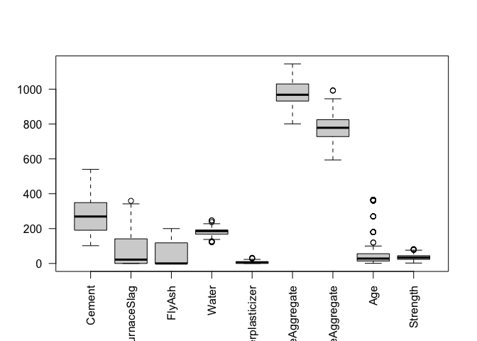<!-- -->

En este último gráfico vemos como se distribuyen las distintas
características. Podemos observar como algunas lo hacen de forma normal
(Cement, CoarseAggregate, FineAggregate). Y otras no (FlyAsh, Age,
Superplasticizer). Posteriormente veremos diferentes filtros para
intentar normalizarlas todas.

## Explorar todos los pares de datos

``` r
pairs(datos) # descriptiva bivariante
```

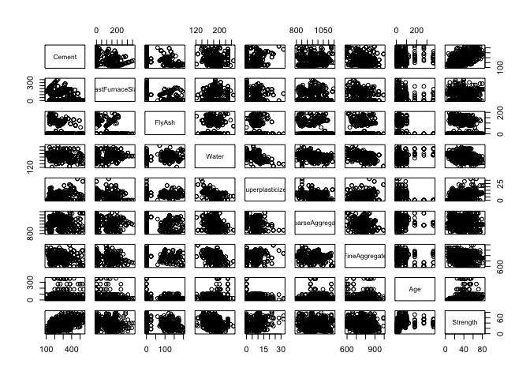<!-- -->

Con este gráfico, podemos ver como se relacionan todas las
características entre ellas una a una. De todas ellas nos interesa ver
como se relaciona cada una de las características con la variable
resultado (Strenght). A simple vista, la que parece tener la relación
lineal más clara con Strenght es el Cemento (cuando este incrementa,
también lo hace la Dureza)

## Descriptiva bivariante para la variable Cemento

``` r
plot(Strength~Cement,datos)                       # puntos
with(datos,lines(lowess(Strength~Cement),col=2))  # estimacion no parametrica de la relacion
```

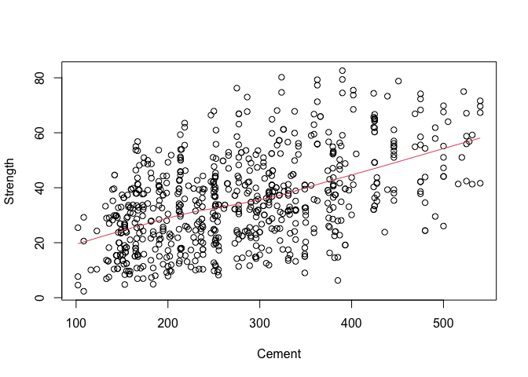<!-- -->

Con esta estimación (linea roja), afirmamos pues, que la relación es
lineal

## Descriptiva bivariante para todas las variables

``` r
par(mfrow=c(2,4))
for(i in 1:8){
  plot(datos$Strength~datos[,i],main=names(datos)[i],xlab=names(datos)[i],ylab="Strength")
  with(datos,lines(lowess(Strength~datos[,i]),col=2))
}
```

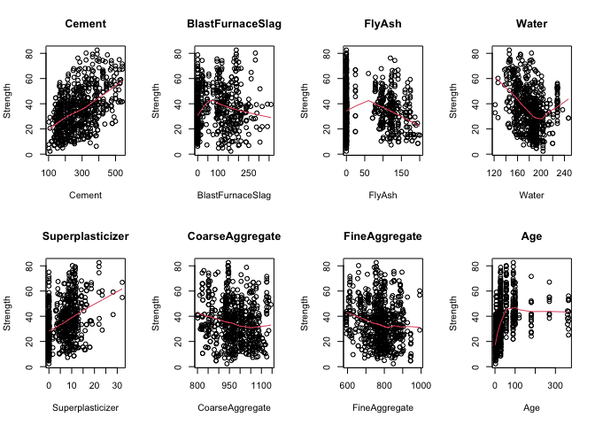<!-- -->

Ahora, con todas las otras características, vemos que algunas tinenen
curvatura (Age, Water, BlastFurnaceSlag), por ende no presentan una
relación lineal. Y otras sí, como el superplasticizer o el
CoarseAggregate

# 2\. Ajuste del Modelo

## Ajuste del Modelo lineal simple

``` r
mod.lm0 <- lm(Strength~Cement,datos)
summary(mod.lm0)
```

    ## 
    ## Call:
    ## lm(formula = Strength ~ Cement, data = datos)
    ## 
    ## Residuals:
    ##     Min      1Q  Median      3Q     Max 
    ## -37.618 -10.903  -0.733   9.856  41.291 
    ## 
    ## Coefficients:
    ##              Estimate Std. Error t value Pr(>|t|)    
    ## (Intercept) 12.620040   1.560795   8.086  2.7e-15 ***
    ## Cement       0.081215   0.005271  15.407  < 2e-16 ***
    ## ---
    ## Signif. codes:  0 '***' 0.001 '**' 0.01 '*' 0.05 '.' 0.1 ' ' 1
    ## 
    ## Residual standard error: 14.22 on 704 degrees of freedom
    ## Multiple R-squared:  0.2521, Adjusted R-squared:  0.2511 
    ## F-statistic: 237.4 on 1 and 704 DF,  p-value: < 2.2e-16

  - **Residuals**: descriptiva de los residuos (errores).
  - **Coeficientes**:
      - *Estimate*: coeficientes del termino independiente (intercept) y
        el cemento. Por cada unidad de cemento que yo agrego, la dureza
        augmenta en 0.08 uds.
      - *Std. Error*: Error estándar de la estimación, en el caso del
        Cemento, estimamos un valor de 0,08 pero con un error de +-
        0.005
      - *t value*: Es la relación que hay entre la Estimación y el Std.
        Error (Estimación/Error). Nos interesa que sea lo mayor posible,
        lo que signfica que hay un error pequeno
      - *Pr(\>|t|)*: P-valor de los coeficientes. Utiliza el t-valor
        para hacerlo. Un valor muy pequeno de este (\< 0.05) implica que
        descartamos la hipótesis nula, es decir, que el coeficiente sea
        0. Dicho de otra forma, en el caso del cemento, implica que éste
        está influyendo sobre la variable respuesta (Dureza). Nos
        aseguramos que no es un coeficiente igual a 0, lo que por
        contra, significaría que el cemento no tiene ningún impacto
        sobre la Dureza (por cada unidad de cemento que agrego, la
        dureza varia +- 0) y por tanto no deberíamos utilizarla como
        característica del modelo.
  - **Signif. codes**: el R nos ayuda y directamente nos califica cada
    coeficiente según si son más o menos significativos: `0 ‘***’ 0.001
    ‘**’ 0.01 ‘*’ 0.05 ‘.’ 0.1 ‘ ’ 1`.
      - p-valor entre (0 y 0.001): `***`
      - p-valor entre (0.001 y 0.01): `**`,
      - p-valor entre (0.01 y 0.05): `*`,
      - p-valor entre (0.05 y 0.1): `.`,
      - p-valor entre (0.1 y 1): `  `
  - **Residual standard error**: Como la media de los residuos, lo que
    espero equivocarme utilizando el modelo
  - **Multiple R-squared**: \(R^2\) Es el porcentaje de variabilidad que
    explica el modelo. Cerca de 0 no explica nada, cerca del 1 explica
    mucho. En este caso, considerando que tenemos una única variable
    (Cemento), un valor de 0.25 está bastante bien, podemos explicar un
    25% de la dureza utilizando el cemento.
  - **F-static**: si el modelo en general explica algo o no

<!-- end list -->

``` r
par(mfrow=c(1,1))
plot(Strength~Cement,datos)
abline(mod.lm0,col="red")
```

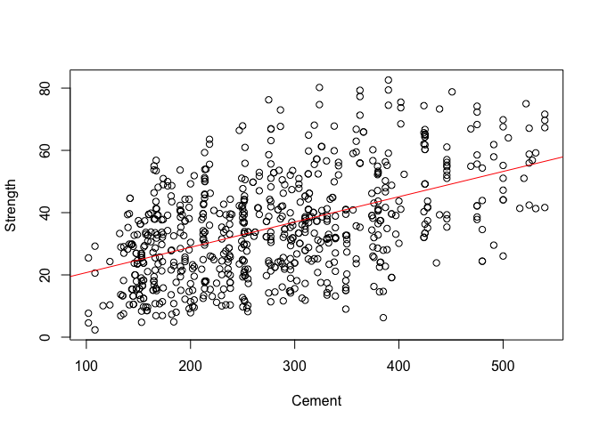<!-- -->

La línea roja es el modelo lineal

## Ajuste del modelo multivariado

``` r
mod.lm1 <- lm(Strength~Cement + BlastFurnaceSlag + FlyAsh +      
                       Water + Superplasticizer + CoarseAggregate +
                       FineAggregate + Age,datos)                   # Ajuste del modelo
# mod.lm1 <- lm(Strength~.,datos)                                     # Instruccion equivalente a la anterior
mod.lm1                                                             # Ver coeficientes
```

    ## 
    ## Call:
    ## lm(formula = Strength ~ Cement + BlastFurnaceSlag + FlyAsh + 
    ##     Water + Superplasticizer + CoarseAggregate + FineAggregate + 
    ##     Age, data = datos)
    ## 
    ## Coefficients:
    ##      (Intercept)            Cement  BlastFurnaceSlag            FlyAsh  
    ##        -32.90148           0.12537           0.10706           0.09151  
    ##            Water  Superplasticizer   CoarseAggregate     FineAggregate  
    ##         -0.13137           0.34550           0.02139           0.02127  
    ##              Age  
    ##          0.11199

``` r
summary(mod.lm1)                                                    # Resumen del modelo
```

    ## 
    ## Call:
    ## lm(formula = Strength ~ Cement + BlastFurnaceSlag + FlyAsh + 
    ##     Water + Superplasticizer + CoarseAggregate + FineAggregate + 
    ##     Age, data = datos)
    ## 
    ## Residuals:
    ##     Min      1Q  Median      3Q     Max 
    ## -26.657  -6.159   0.600   6.645  31.919 
    ## 
    ## Coefficients:
    ##                    Estimate Std. Error t value Pr(>|t|)    
    ## (Intercept)      -32.901477  33.369889  -0.986  0.32449    
    ## Cement             0.125369   0.010608  11.818  < 2e-16 ***
    ## BlastFurnaceSlag   0.107063   0.012488   8.573  < 2e-16 ***
    ## FlyAsh             0.091511   0.015440   5.927 4.85e-09 ***
    ## Water             -0.131372   0.050861  -2.583  0.01000 ** 
    ## Superplasticizer   0.345505   0.115764   2.985  0.00294 ** 
    ## CoarseAggregate    0.021390   0.011625   1.840  0.06620 .  
    ## FineAggregate      0.021270   0.013206   1.611  0.10772    
    ## Age                0.111992   0.006377  17.562  < 2e-16 ***
    ## ---
    ## Signif. codes:  0 '***' 0.001 '**' 0.01 '*' 0.05 '.' 0.1 ' ' 1
    ## 
    ## Residual standard error: 10.11 on 697 degrees of freedom
    ## Multiple R-squared:  0.6253, Adjusted R-squared:  0.621 
    ## F-statistic: 145.4 on 8 and 697 DF,  p-value: < 2.2e-16

  - Análisis rápido de la estimación: por cada unidad de cemento que
    agreguemos, la dureza augmentará 0.125. En cambio, por cada unidad
    de agua que agreguemos, la dureza se reducirá en 0.13
  - A simple vista ya vemos las variables más significativas, con tres
    estrellas (Cemento, FlyAsh, Age..) y las menos (FineAggregate,
    CoarseAggregate).
  - Importante destacar el R-squared: ha augmentado considerablemente
    (0.6253) en comparación al 0.25 que teníamos en el modelo anterior
    con solo el Cemento como variable. Ésto nos indica que ahora con
    éste modelo que contiene todas las variables podemos explicar un
    63% la dureza

## Selección automática de variables

``` r
mod.lm2 <- step(mod.lm1)                   # Seleccionar variables
```

    ## Start:  AIC=3276.1
    ## Strength ~ Cement + BlastFurnaceSlag + FlyAsh + Water + Superplasticizer + 
    ##     CoarseAggregate + FineAggregate + Age
    ## 
    ##                    Df Sum of Sq    RSS    AIC
    ## <none>                           71288 3276.1
    ## - FineAggregate     1     265.3  71553 3276.7
    ## - CoarseAggregate   1     346.2  71634 3277.5
    ## - Water             1     682.4  71970 3280.8
    ## - Superplasticizer  1     911.1  72199 3283.1
    ## - FlyAsh            1    3592.9  74881 3308.8
    ## - BlastFurnaceSlag  1    7517.1  78805 3344.9
    ## - Cement            1   14285.8  85574 3403.0
    ## - Age               1   31544.5 102833 3532.8

  - AIC: Se mira qué bueno es el modelo y por otra parte el numero de
    parámetros que tiene el modelo. Nos interesa que el modelo sea lo
    más bueno posible (verosimilitud) con el mínimo de variables
    posibles. Cuanto más pequeno es el AIC mejor.
  - En la tabla anterior observamos el AIC resultante por cada variable
    que quitamos al modelo. En este caso, si NO quitamos ninguna,
    tenemos el valor más pequeno del AIC, que es lo que buscamos.

<!-- end list -->

``` r
summary(mod.lm2)                           # Modelo con variables seleccionadas
```

    ## 
    ## Call:
    ## lm(formula = Strength ~ Cement + BlastFurnaceSlag + FlyAsh + 
    ##     Water + Superplasticizer + CoarseAggregate + FineAggregate + 
    ##     Age, data = datos)
    ## 
    ## Residuals:
    ##     Min      1Q  Median      3Q     Max 
    ## -26.657  -6.159   0.600   6.645  31.919 
    ## 
    ## Coefficients:
    ##                    Estimate Std. Error t value Pr(>|t|)    
    ## (Intercept)      -32.901477  33.369889  -0.986  0.32449    
    ## Cement             0.125369   0.010608  11.818  < 2e-16 ***
    ## BlastFurnaceSlag   0.107063   0.012488   8.573  < 2e-16 ***
    ## FlyAsh             0.091511   0.015440   5.927 4.85e-09 ***
    ## Water             -0.131372   0.050861  -2.583  0.01000 ** 
    ## Superplasticizer   0.345505   0.115764   2.985  0.00294 ** 
    ## CoarseAggregate    0.021390   0.011625   1.840  0.06620 .  
    ## FineAggregate      0.021270   0.013206   1.611  0.10772    
    ## Age                0.111992   0.006377  17.562  < 2e-16 ***
    ## ---
    ## Signif. codes:  0 '***' 0.001 '**' 0.01 '*' 0.05 '.' 0.1 ' ' 1
    ## 
    ## Residual standard error: 10.11 on 697 degrees of freedom
    ## Multiple R-squared:  0.6253, Adjusted R-squared:  0.621 
    ## F-statistic: 145.4 on 8 and 697 DF,  p-value: < 2.2e-16

Al no quitar ninguna variable, tenemos el mismo modelo que el anterior
(lm1)

## Validación de las premisas

Premisas: - **Linealidad**: Una recta/plano/hiperplano se ajusta bien a
los datos - **Homoscedasticidad**: Variabilidad constante - **Normalidad
de los residuos**: Los errores son normales - **Independencia**: La
muestra es aleatoria simple y el resultado de una observación no
condiciona el resto

``` r
par(mfrow=c(2,2))                          # ventana para 4 gr?ficos
plot(mod.lm2)                              # graficos para valorar premisas
```

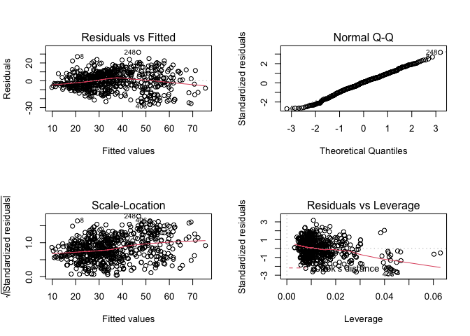<!-- -->

  - **Residuals vs Fitted**: Nos indica la Homoscedasticidad, para
    cumplirla, los residuos, deberían distribuirse de la misma forma por
    todo el rango de los ‘Fitted values’ (estimaciones). Así pues, vemos
    que no es el caso, ya que cuando éstos son pequenos, los residuos
    oscilan menos (muy cercanos a la linea roja). Y en cambio cuando
    mayor son los las estimaciones, más dispersos son los residuos
  - **Scale-Location**: Con el mismo propósito que el anterior, pero
    estandarizando los residuos, de forma que estos son todos positivos.
    (Es como si plegaramos el diagrama anterior por la mitad). Con esto,
    nos podemos fijar en la línea roja, y en este caso observar que
    tiene una tendencia decreciente, es decir, que cuando mayor es la
    estimación más grande es el residuo (más error tenemos).
  - **Normal Q-Q**: Nos sirve para ver si el las estimaciones estan
    distribuidos de forma normal o no. En este caso vemos que a
    excepción de valores muy pequenos y grandes sí que lo hacen.
  - [**Residuals vs
    Leverage**](https://boostedml.com/2019/03/linear-regression-plots-residuals-vs-leverage.html):
    Este gráfico nos sirve para ver como cambia la dispersión de los
    residuos estandarizados cuando el
    [leverage](https://en.wikipedia.org/wiki/Leverage_\(statistics\))
    (puntos de influencia) incrementan. La dispersión de los residuos
    estandarizados no deberían cambiar cuando los puntos de influencia
    augmentan (nos estamos fijando en los puntos negros): en este caso
    parece que disminuye, lo que indica homoscedesticidad.
      - Por otro lado los puntos con un gran ‘leverage’ son puntos de
        **gran influencia**, por lo que eliminarlos harían cambiar mucho
        el modelo. Para este propósito nos fijamos en la línea de Cook
        (la cual mesura el efecto de eliminar el valor). Todos los
        puntos fuera de ésta línea indican que tienen una gran
        influencia. En este caso vemos que no hay ninguno que esté furea
        la línea de Cook (de hecho la línea no llega ni a aparecer en el
        diagrama).

## Nueva descriptiva: Residuos vs variables predictoras

``` r
library(car)
residualPlots(mod.lm2)
```

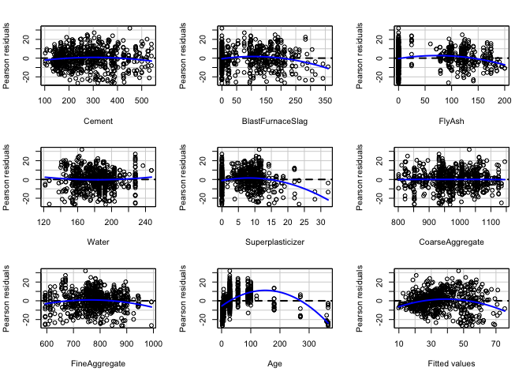<!-- -->

    ##                  Test stat Pr(>|Test stat|)    
    ## Cement             -2.1451        0.0322934 *  
    ## BlastFurnaceSlag   -3.9334        9.213e-05 ***
    ## FlyAsh             -4.4095        1.200e-05 ***
    ## Water               1.3204        0.1871504    
    ## Superplasticizer   -6.4614        1.950e-10 ***
    ## CoarseAggregate    -0.1279        0.8982890    
    ## FineAggregate      -3.4735        0.0005456 ***
    ## Age               -18.0269        < 2.2e-16 ***
    ## Tukey test         -5.5063        3.664e-08 ***
    ## ---
    ## Signif. codes:  0 '***' 0.001 '**' 0.01 '*' 0.05 '.' 0.1 ' ' 1

  - Aquí podemos observar por cada característica como varia la
    dispersión de los residuos. Lo que buscamos, otra vez, es que ésta
    no varie a lo largo de los valores de cada característica. Como
    vemos, las características que lo cumplen son: Cement,
    CoarseAggregate y Water. En las otras, en cambio, observamos
    curvaturas lo cual indican justamente lo contrario.
  - Tendremos que aplicar transformaciones a éstas características para
    linealizarlas

## Transformaciones polinomicas sobre las predictoras con poly

Con poly: que se incluyen términos polinómicos de orden mayor

``` r
mod.lm4 <- lm(Strength ~ poly(Cement,2) + poly(BlastFurnaceSlag,2) + poly(FlyAsh,2)+
                         poly(Water,2) + poly(Superplasticizer,2) + CoarseAggregate +
                         poly(FineAggregate,2) + poly(Age,2),datos) # generamos el nuevo modelo con las transformaciones
summary(mod.lm4)
```

    ## 
    ## Call:
    ## lm(formula = Strength ~ poly(Cement, 2) + poly(BlastFurnaceSlag, 
    ##     2) + poly(FlyAsh, 2) + poly(Water, 2) + poly(Superplasticizer, 
    ##     2) + CoarseAggregate + poly(FineAggregate, 2) + poly(Age, 
    ##     2), data = datos)
    ## 
    ## Residuals:
    ##     Min      1Q  Median      3Q     Max 
    ## -23.851  -4.481  -0.141   4.931  29.541 
    ## 
    ## Coefficients:
    ##                              Estimate Std. Error t value Pr(>|t|)    
    ## (Intercept)                 3.254e+01  9.090e+00   3.579 0.000369 ***
    ## poly(Cement, 2)1            2.978e+02  2.296e+01  12.971  < 2e-16 ***
    ## poly(Cement, 2)2           -6.135e+00  8.680e+00  -0.707 0.479957    
    ## poly(BlastFurnaceSlag, 2)1  2.028e+02  2.273e+01   8.919  < 2e-16 ***
    ## poly(BlastFurnaceSlag, 2)2 -2.665e+01  8.401e+00  -3.172 0.001580 ** 
    ## poly(FlyAsh, 2)1            7.784e+01  2.214e+01   3.516 0.000466 ***
    ## poly(FlyAsh, 2)2           -2.274e+01  8.576e+00  -2.651 0.008201 ** 
    ## poly(Water, 2)1            -1.047e+02  2.236e+01  -4.683 3.40e-06 ***
    ## poly(Water, 2)2             3.500e+01  9.764e+00   3.585 0.000361 ***
    ## poly(Superplasticizer, 2)1  3.549e+01  1.487e+01   2.386 0.017294 *  
    ## poly(Superplasticizer, 2)2 -5.765e+01  9.853e+00  -5.851 7.53e-09 ***
    ## CoarseAggregate             2.749e-03  9.339e-03   0.294 0.768617    
    ## poly(FineAggregate, 2)1     8.681e+00  2.264e+01   0.383 0.701496    
    ## poly(FineAggregate, 2)2    -4.201e+01  9.126e+00  -4.604 4.93e-06 ***
    ## poly(Age, 2)1               1.822e+02  8.453e+00  21.549  < 2e-16 ***
    ## poly(Age, 2)2              -1.506e+02  7.937e+00 -18.969  < 2e-16 ***
    ## ---
    ## Signif. codes:  0 '***' 0.001 '**' 0.01 '*' 0.05 '.' 0.1 ' ' 1
    ## 
    ## Residual standard error: 7.792 on 690 degrees of freedom
    ## Multiple R-squared:  0.7798, Adjusted R-squared:  0.775 
    ## F-statistic: 162.9 on 15 and 690 DF,  p-value: < 2.2e-16

  - Vemos todos los coeficientes de todas las características aplicando
    transformaciones polinomicas de 1er y 2o grado y la significancia de
    cada una de ellas. A excepción del ‘CoarseAggregate’, que como
    habiamos observado anteriormente ya seguía una forma lineal y no
    requeria de transformación.
  - Por otro lado, vemos que el error estándar ha disminuido (7.92 vs
    10.0) en el modelo anterior, y que el R-squared ha augmentado
    (0.7798 vs 0.6253), por lo que ahora podemos explicar un 0.7798 de
    la dureza con este modelo. En general, hemos obtenido una mejora
    sustancial respecto respecto al modelo anterior únicamente
    transformando las variables predictoras.

### Selección automática de características

Seleccionamos automáticamente las características a utilizar del modelo
anterior (lm4)

``` r
mod.lm5 <- step(mod.lm4) # Seleccion automatica de caracteristicas
```

    ## Start:  AIC=2914.8
    ## Strength ~ poly(Cement, 2) + poly(BlastFurnaceSlag, 2) + poly(FlyAsh, 
    ##     2) + poly(Water, 2) + poly(Superplasticizer, 2) + CoarseAggregate + 
    ##     poly(FineAggregate, 2) + poly(Age, 2)
    ## 
    ##                             Df Sum of Sq   RSS    AIC
    ## - CoarseAggregate            1         5 41900 2912.9
    ## <none>                                   41894 2914.8
    ## - poly(FineAggregate, 2)     2      1288 43183 2932.2
    ## - poly(FlyAsh, 2)            2      1291 43186 2932.2
    ## - poly(Superplasticizer, 2)  2      2154 44049 2946.2
    ## - poly(Water, 2)             2      2259 44153 2947.9
    ## - poly(BlastFurnaceSlag, 2)  2      5091 46986 2991.8
    ## - poly(Cement, 2)            2     10217 52111 3064.9
    ## - poly(Age, 2)               2     51197 93092 3474.5
    ## 
    ## Step:  AIC=2912.89
    ## Strength ~ poly(Cement, 2) + poly(BlastFurnaceSlag, 2) + poly(FlyAsh, 
    ##     2) + poly(Water, 2) + poly(Superplasticizer, 2) + poly(FineAggregate, 
    ##     2) + poly(Age, 2)
    ## 
    ##                             Df Sum of Sq   RSS    AIC
    ## <none>                                   41900 2912.9
    ## - poly(FineAggregate, 2)     2      1305 43205 2930.6
    ## - poly(FlyAsh, 2)            2      1684 43584 2936.7
    ## - poly(Superplasticizer, 2)  2      2150 44050 2944.2
    ## - poly(Water, 2)             2      5547 47447 2996.7
    ## - poly(BlastFurnaceSlag, 2)  2     14386 56286 3117.3
    ## - poly(Cement, 2)            2     28692 70591 3277.2
    ## - poly(Age, 2)               2     51460 93360 3474.5

Vemos que lo que da mejor resultado es elminiar el CoarseAggregate, ya
que aparece el primero de la lista y el AIC resultante tras su
eleminación es el menor de todos (2912.9), respecto (1214.9) si no
elimináramos ninguna.

``` r
summary(mod.lm5) # Descriptiva del modelo
```

    ## 
    ## Call:
    ## lm(formula = Strength ~ poly(Cement, 2) + poly(BlastFurnaceSlag, 
    ##     2) + poly(FlyAsh, 2) + poly(Water, 2) + poly(Superplasticizer, 
    ##     2) + poly(FineAggregate, 2) + poly(Age, 2), data = datos)
    ## 
    ## Residuals:
    ##      Min       1Q   Median       3Q      Max 
    ## -23.7961  -4.4395  -0.1394   4.9763  29.5278 
    ## 
    ## Coefficients:
    ##                             Estimate Std. Error t value Pr(>|t|)    
    ## (Intercept)                  35.2095     0.2931 120.142  < 2e-16 ***
    ## poly(Cement, 2)1            292.3493    13.4585  21.722  < 2e-16 ***
    ## poly(Cement, 2)2             -6.1698     8.6738  -0.711 0.477133    
    ## poly(BlastFurnaceSlag, 2)1  197.2719    13.0097  15.163  < 2e-16 ***
    ## poly(BlastFurnaceSlag, 2)2  -26.3240     8.3224  -3.163 0.001630 ** 
    ## poly(FlyAsh, 2)1             73.2990    15.8765   4.617 4.65e-06 ***
    ## poly(FlyAsh, 2)2            -23.1851     8.4352  -2.749 0.006141 ** 
    ## poly(Water, 2)1            -110.2495    12.2046  -9.033  < 2e-16 ***
    ## poly(Water, 2)2              34.6832     9.6968   3.577 0.000372 ***
    ## poly(Superplasticizer, 2)1   34.0869    14.0778   2.421 0.015721 *  
    ## poly(Superplasticizer, 2)2  -57.6252     9.8460  -5.853 7.47e-09 ***
    ## poly(FineAggregate, 2)1       2.9844    11.7326   0.254 0.799288    
    ## poly(FineAggregate, 2)2     -41.9568     9.1175  -4.602 4.98e-06 ***
    ## poly(Age, 2)1               182.1311     8.4469  21.562  < 2e-16 ***
    ## poly(Age, 2)2              -150.7945     7.8900 -19.112  < 2e-16 ***
    ## ---
    ## Signif. codes:  0 '***' 0.001 '**' 0.01 '*' 0.05 '.' 0.1 ' ' 1
    ## 
    ## Residual standard error: 7.787 on 691 degrees of freedom
    ## Multiple R-squared:  0.7798, Adjusted R-squared:  0.7753 
    ## F-statistic: 174.8 on 14 and 691 DF,  p-value: < 2.2e-16

Tras eliminar el CoarseAggregate y hacer la descriptiva del modelo,
podemos observar que el resultado no varia significativamente respecto
el modelo anterior (lm4). El multipple R-squared se mantiene igual y
solo disminuye muy levemente el error estándar.

### Colinealidad

Para analizar la colinealidad de las variables (qué tan relacionadas
estan entre si) utilizamos el VIF:

  - Por orden general, un VIF mayor que 5 u 8 es un valor muy grande que
    nos indica que hay una relación entre las características, es decir,
    que las características en cuestión nos explican lo mismo, por lo
    que no tiene sentido tenerlas juntas en el modelo.
  - Por contra, un VIF menor a 5 nos indica que las variables
    predictoras no estan muy relacionadas entre si. Es lo que buscamos.

<!-- end list -->

``` r
vif(mod.lm5)
```

    ##                               GVIF Df GVIF^(1/(2*Df))
    ## poly(Cement, 2)           3.679321  2        1.384975
    ## poly(BlastFurnaceSlag, 2) 3.185465  2        1.335959
    ## poly(FlyAsh, 2)           4.867835  2        1.485368
    ## poly(Water, 2)            3.800342  2        1.396226
    ## poly(Superplasticizer, 2) 4.945473  2        1.491255
    ## poly(FineAggregate, 2)    3.009788  2        1.317146
    ## poly(Age, 2)              1.207466  2        1.048259

## Validación

``` r
par(mfrow=c(2,2))
plot(mod.lm5) # Validación de las premisas
```

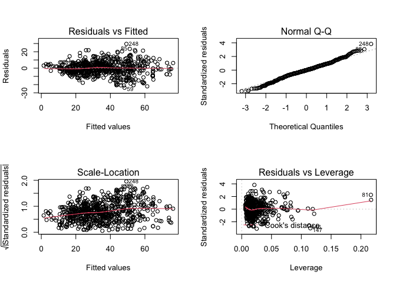<!-- -->

  - **Linealidad**: Se cumple. (Residuals vs Fitted) vemos que los
    residuos se distribuyen uniformemente por encima y por debajo del
    cero a lo largo de los valores predichos. Se ve claramente con la
    línea roja recta en el 0.
  - **Homocedasticidad**: Se cumple. (Residuals vs Fitted) En
    comparación al modelo lm2, la homoscedesticidad ha mejorado un
    poco, ahora vemos una mejor distribución de los residuales a lo
    largo de las estimaciones, aunque seguimos teniendo un poco forma de
    embudo (residuos más concentrados en valores predichos pequenos y
    más dispersos en valores predichos grandes)
  - **Normalidad de los residuos**: Se cumple. (Normal Q-Q). Los
    residuos se ajustan bastante bien a la recta de Normalidad
  - **Independencia**: Suponemos que se cumple. (Depende del buen diseño
    de la recogida de datos)

<!-- end list -->

``` r
residualPlots(mod.lm5)
```

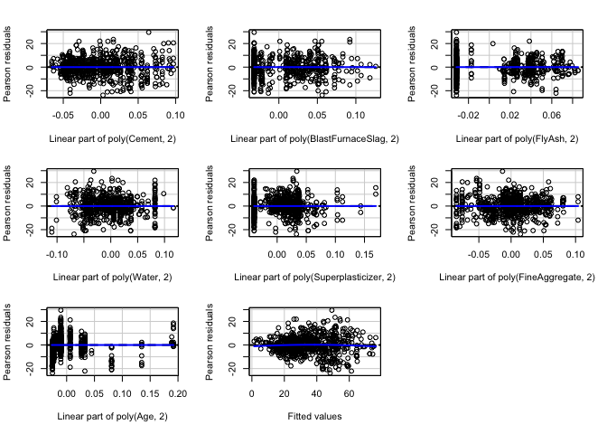<!-- -->

    ##                           Test stat Pr(>|Test stat|)
    ## poly(Cement, 2)                                     
    ## poly(BlastFurnaceSlag, 2)                           
    ## poly(FlyAsh, 2)                                     
    ## poly(Water, 2)                                      
    ## poly(Superplasticizer, 2)                           
    ## poly(FineAggregate, 2)                              
    ## poly(Age, 2)                                        
    ## Tukey test                  -0.9631           0.3355

  - En el plot de arriba tenemos el gráfico (Residuals vs Fitted) para
    cada característica por separado.
  - Vemos que todas cumplen la premisa de Linealidad, pero no la de
    Homocedasticidad, ya que en diversas características los residuos no
    estan distribuidos uniformemente (Age, Superplasticizer)
  - Aun así, las premisas más importantes son las del modelo completo,
    con todas las características, analizadas anteriormente y validadas.

## Transformación BoxCox sobre la respuesta

Transformamos ahora las estimaciones para ver si podemos mejorar aun más
el modelo.

### 1\. Buscamos la lambda óptima

``` r
par(mfrow=c(1,1))
bc <- boxCox(mod.lm5)
```

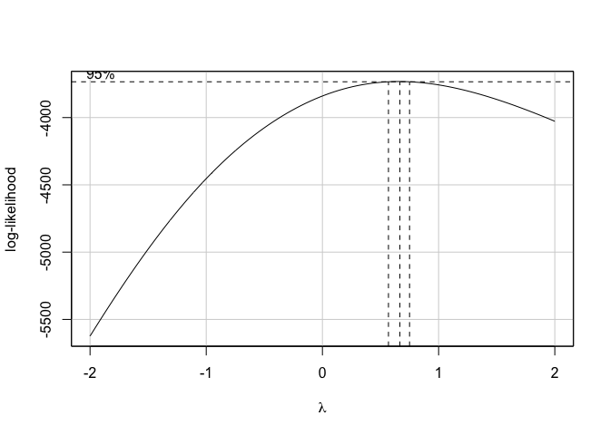<!-- -->

``` r
bc$x[which.max(bc$y)] #lambda optima la cual vamos a elevar las variables resultado (dureza) a esta lambda 
```

    ## [1] 0.6666667

### 2\. Transformamos las variables resultado y analizamos el modelo resultante

``` r
lamb <- bc$x[which.max(bc$y)]  
datos$Strength2 <- datos$Strength^lamb
mod.lm6 <- lm(Strength2~poly(Cement,2) + poly(BlastFurnaceSlag,2) + poly(FlyAsh,2) +
                        poly(Water,2) + poly(Superplasticizer,2) +
                        poly(FineAggregate,2) + poly(Age,2), datos)
summary(mod.lm6)
```

    ## 
    ## Call:
    ## lm(formula = Strength2 ~ poly(Cement, 2) + poly(BlastFurnaceSlag, 
    ##     2) + poly(FlyAsh, 2) + poly(Water, 2) + poly(Superplasticizer, 
    ##     2) + poly(FineAggregate, 2) + poly(Age, 2), data = datos)
    ## 
    ## Residuals:
    ##     Min      1Q  Median      3Q     Max 
    ## -4.7121 -0.9539  0.0525  1.0888  5.1841 
    ## 
    ## Coefficients:
    ##                             Estimate Std. Error t value Pr(>|t|)    
    ## (Intercept)                 10.46688    0.06007 174.240  < 2e-16 ***
    ## poly(Cement, 2)1            60.06774    2.75869  21.774  < 2e-16 ***
    ## poly(Cement, 2)2            -3.06913    1.77794  -1.726 0.084752 .  
    ## poly(BlastFurnaceSlag, 2)1  40.35857    2.66670  15.134  < 2e-16 ***
    ## poly(BlastFurnaceSlag, 2)2  -5.16287    1.70590  -3.026 0.002566 ** 
    ## poly(FlyAsh, 2)1            16.80577    3.25432   5.164 3.16e-07 ***
    ## poly(FlyAsh, 2)2            -6.12619    1.72903  -3.543 0.000422 ***
    ## poly(Water, 2)1            -22.06766    2.50167  -8.821  < 2e-16 ***
    ## poly(Water, 2)2              6.87865    1.98761   3.461 0.000572 ***
    ## poly(Superplasticizer, 2)1   6.61168    2.88563   2.291 0.022249 *  
    ## poly(Superplasticizer, 2)2 -11.72862    2.01820  -5.811 9.46e-09 ***
    ## poly(FineAggregate, 2)1     -0.58786    2.40491  -0.244 0.806963    
    ## poly(FineAggregate, 2)2     -8.21191    1.86887  -4.394 1.29e-05 ***
    ## poly(Age, 2)1               38.28213    1.73142  22.110  < 2e-16 ***
    ## poly(Age, 2)2              -31.57930    1.61727 -19.526  < 2e-16 ***
    ## ---
    ## Signif. codes:  0 '***' 0.001 '**' 0.01 '*' 0.05 '.' 0.1 ' ' 1
    ## 
    ## Residual standard error: 1.596 on 691 degrees of freedom
    ## Multiple R-squared:  0.7824, Adjusted R-squared:  0.778 
    ## F-statistic: 177.4 on 14 and 691 DF,  p-value: < 2.2e-16

Comparamos otra vez con los modelos anteriores y vemos:

  - El error estándar a disminuido de 7.792 en el lm4 vs 1.596 ahora
  - El multiple R-squared ha augmentado muy levemente: 0.7798 vs 0.7824
    ahora

### 3\. Validación del modelo

``` r
par(mfrow=c(2,2))
plot(mod.lm6)
```

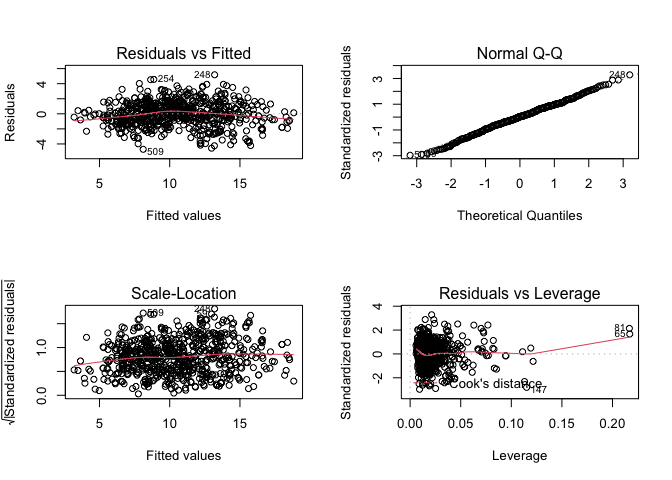<!-- -->

  - Vemos que corregimos los problemas de normalidad, pero que seguimos
    teniendo parabola homesteicedad
  - Nos quedariamos con el modelo 5, que es mas simple y no deteriora
    ninguna premisa. A parte de que la R2 se mantiene practicamente
    igual.

## Observaciones influyentes

``` r
influenceIndexPlot(mod.lm5) 
```

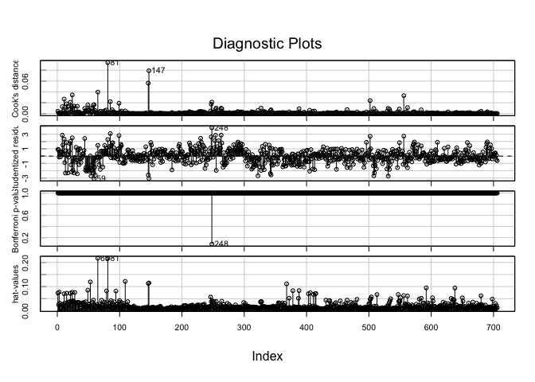<!-- -->

  - Análisis de observaciones:
      - Las observaciones 81 y 147 tienen mucha influencia a posteriori
      - La observación 248 está muy mal explicada por el modelo
      - Las observaciones 65 y 81 tienen mucha influencia a priori.
  - **Cook’s distance**: Con la distancia de Cook vemos que hay unos 3
    puntos influyentes.
  - **Residuals**: no hay ningun punto que destaque, solo uno que tiene
    un residuo de practicamente 4, cuando deberian oscilar entre -2 y 2,
    pero ya esta.
  - **P-valor**: vemos que ninguno llega al 0.05, solo el de 0.1 que
    coincide con el anterior.
