MUBD - Estadistica - Sesion 4: Regresión Logística
================

Documentación:
[MUBD-3.2.Regresion-logística.pdf](./MUBD-3.2.Regresion-logística.pdf)

# 1\. Construir el modelo

``` r
datos <- read.table('bank0_train.txt',header=TRUE,sep=';',stringsAsFactors = TRUE) 
summary(datos)          # Descriptiva de todas las variables
```

    ##                  status       duration    
    ##  < 0 DM             :195   Min.   : 4.00  
    ##  >= 200 DM          : 45   1st Qu.:12.00  
    ##  0 <=  and < 200 DM :178   Median :18.00  
    ##  no checking account:269   Mean   :20.84  
    ##                            3rd Qu.:24.00  
    ##                            Max.   :72.00  
    ##                                           
    ##                                       credit.hist                 purpose   
    ##  all credits at this bank paid back duly    : 38   radio/television   :193  
    ##  critical account                           :190   car (new)          :157  
    ##  delay in paying off in the past            : 64   furniture/equipment:130  
    ##  existing credits paid back duly till now   :370   car (used)         : 68  
    ##  no credits taken/all credits paid back duly: 25   business           : 64  
    ##                                                    education          : 35  
    ##                                                    (Other)            : 40  
    ##    credit.amo                          savings                employed.time
    ##  Min.   :  250   < 100 DM                  :417   < 1 year           :120  
    ##  1st Qu.: 1344   >= 1000 DM                : 31   >= 7 years         :173  
    ##  Median : 2278   100 <=  and < 500 DM      : 65   1 <=  and < 4 years:238  
    ##  Mean   : 3232   500 <=  and < 1000 DM     : 39   4 <=  and < 7 years:116  
    ##  3rd Qu.: 3962   unknown/no savings account:135   unemployed         : 40  
    ##  Max.   :15945                                                             
    ##                                                                            
    ##   installment                                status.sex          debtors   
    ##  Min.   :1.000   female:divorced/separated/married:213   co-applicant: 25  
    ##  1st Qu.:2.000   male:divorced/separated          : 34   guarantor   : 38  
    ##  Median :3.000   male:married/widowed             : 69   none        :624  
    ##  Mean   :3.033   male:single                      :371                     
    ##  3rd Qu.:4.000                                                             
    ##  Max.   :4.000                                                             
    ##                                                                            
    ##  residence.time                                               property  
    ##  Min.   :1.000   building society savings agreement/life insurance:165  
    ##  1st Qu.:2.000   car or other                                     :229  
    ##  Median :3.000   real estate                                      :194  
    ##  Mean   :2.844   unknown/no property                              : 99  
    ##  3rd Qu.:4.000                                                          
    ##  Max.   :4.000                                                          
    ##                                                                         
    ##       age        installment2     housing     num.credits   
    ##  Min.   :19.00   bank  :102   for free: 65   Min.   :1.000  
    ##  1st Qu.:27.00   none  :548   own     :493   1st Qu.:1.000  
    ##  Median :33.00   stores: 37   rent    :129   Median :1.000  
    ##  Mean   :35.56                               Mean   :1.397  
    ##  3rd Qu.:42.00                               3rd Qu.:2.000  
    ##  Max.   :75.00                               Max.   :4.000  
    ##                                                             
    ##                                   job        num.people    telephone  foreign  
    ##  management/self-employed/          : 94   Min.   :1.000   none:410   no : 30  
    ##  skilled employee/official          :433   1st Qu.:1.000   yes :277   yes:657  
    ##  unemployed/unskilled - non-resident: 15   Median :1.000                       
    ##  unskilled - resident               :145   Mean   :1.148                       
    ##                                            3rd Qu.:1.000                       
    ##                                            Max.   :2.000                       
    ##                                                                                
    ##    y      
    ##  no :214  
    ##  yes:473  
    ##           
    ##           
    ##           
    ##           
    ## 

## Descriptiva bivariante

``` r
##-- Variables categoricas
sapply(datos,class)
```

    ##         status       duration    credit.hist        purpose     credit.amo 
    ##       "factor"      "integer"       "factor"       "factor"      "integer" 
    ##        savings  employed.time    installment     status.sex        debtors 
    ##       "factor"       "factor"      "integer"       "factor"       "factor" 
    ## residence.time       property            age   installment2        housing 
    ##      "integer"       "factor"      "integer"       "factor"       "factor" 
    ##    num.credits            job     num.people      telephone        foreign 
    ##      "integer"       "factor"      "integer"       "factor"       "factor" 
    ##              y 
    ##       "factor"

``` r
var.cat <- which(sapply(datos,class)=="factor" & names(datos)!="y")  # variables que son categoricas (factores)
##--Mosaicplot para las categoricas
for(vc in var.cat)  mosaicplot(datos[,vc]~datos$y,main=names(datos)[vc],col=2:3,las=1)
```

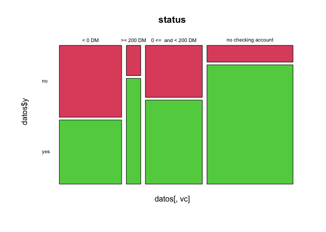<!-- -->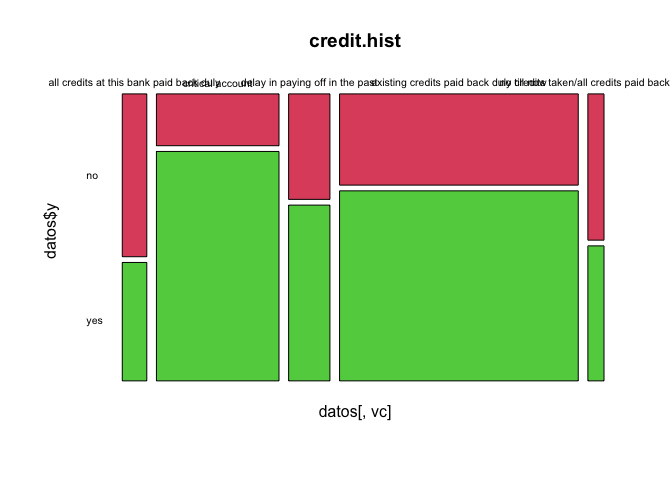<!-- -->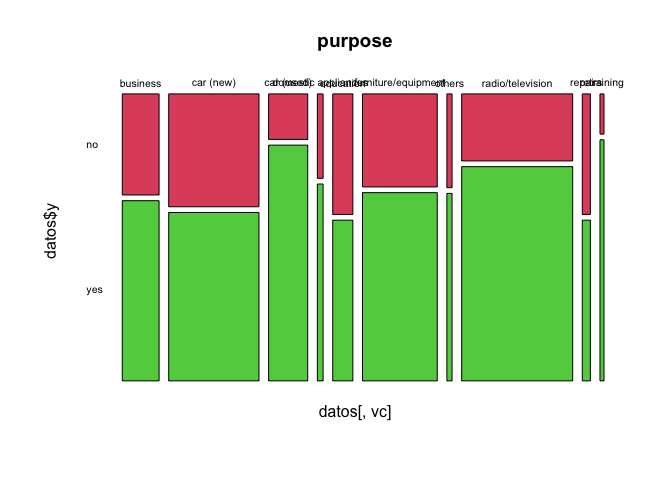<!-- -->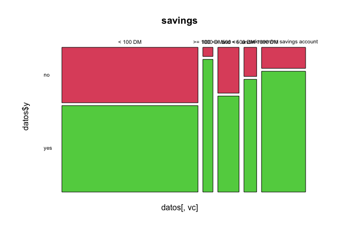<!-- -->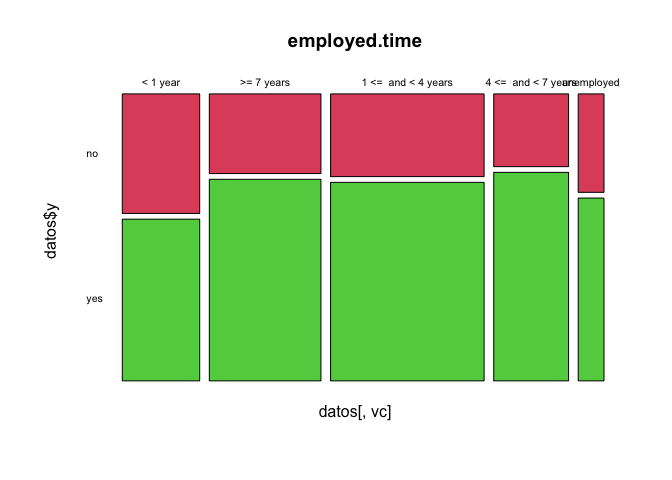<!-- -->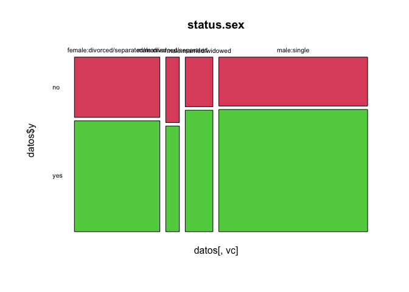<!-- -->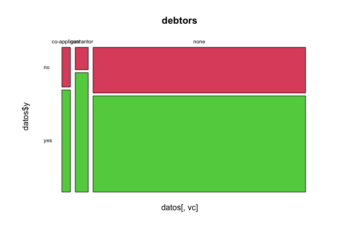<!-- -->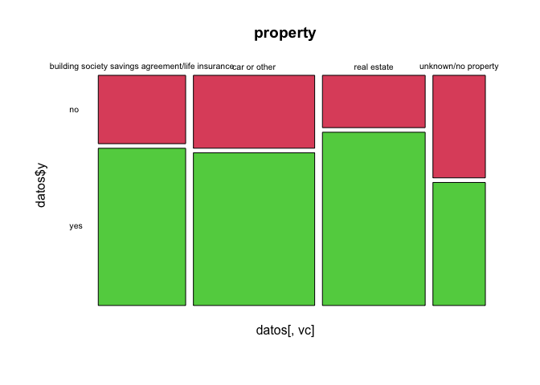<!-- -->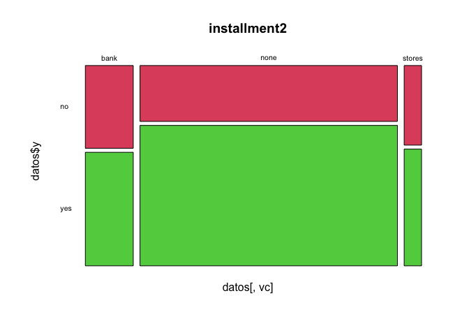<!-- -->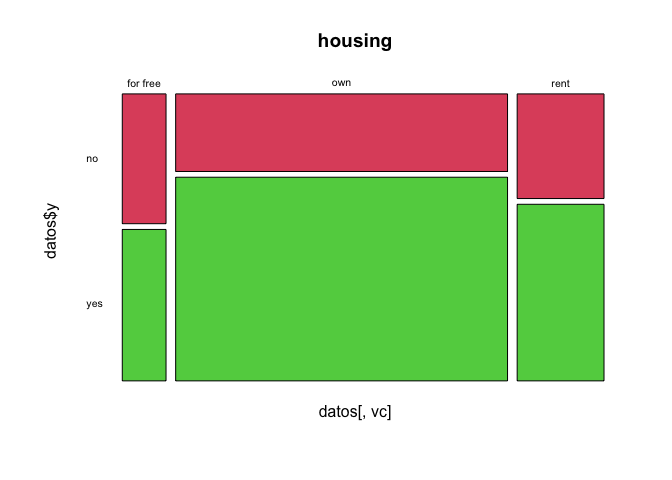<!-- -->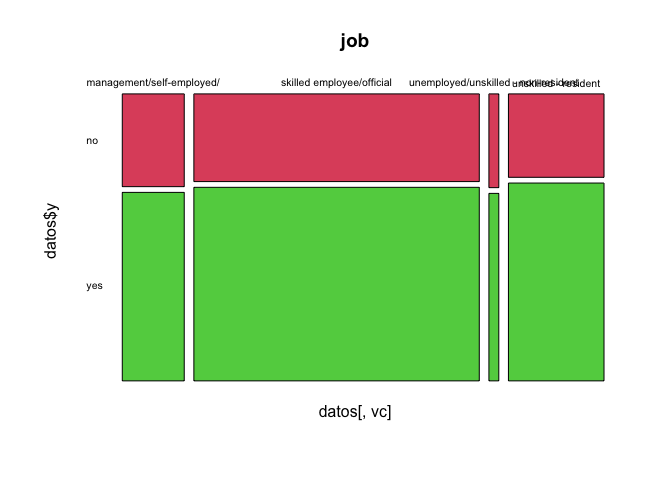<!-- -->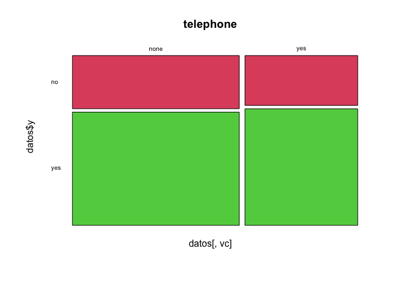<!-- -->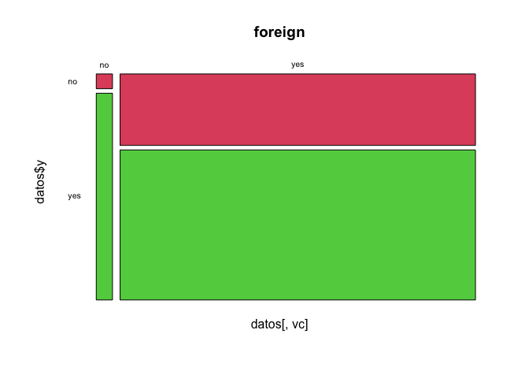<!-- -->

``` r
##--Densidad para las variables numericas
var.num <- which(sapply(datos,class) %in% c("numeric","integer"))    # variables que son numericas
for(vn in var.num) cdplot(datos$y~datos[,vn],main=names(datos)[vn],n=512)
```

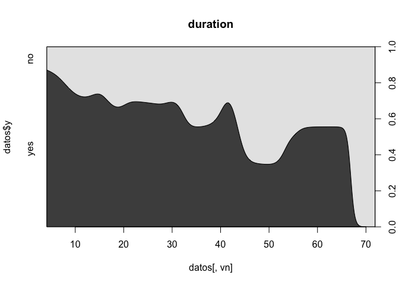<!-- -->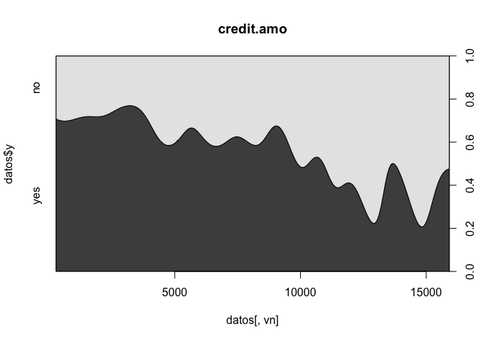<!-- -->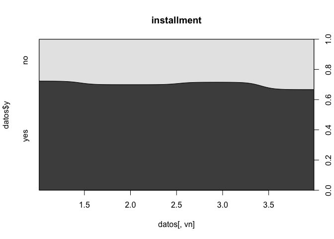<!-- --><!-- -->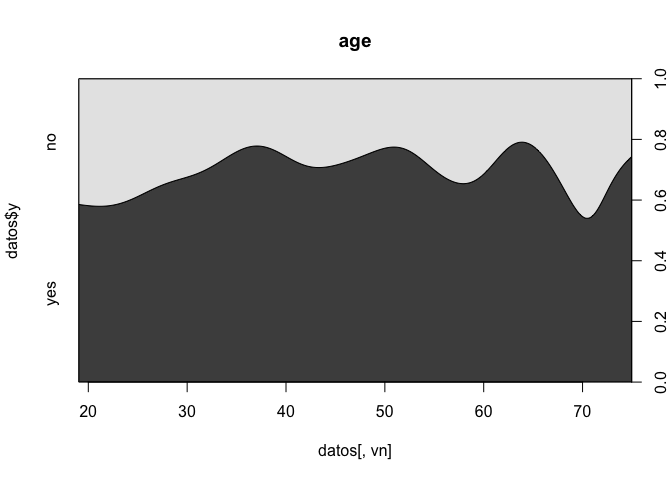<!-- -->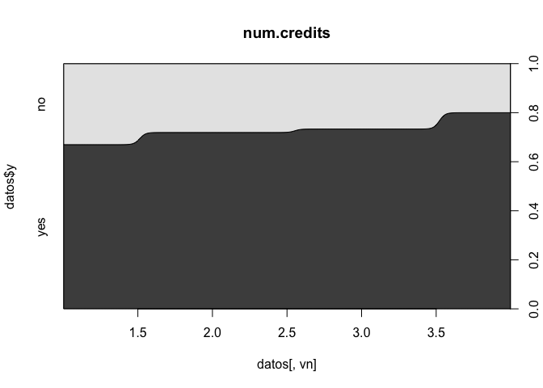<!-- -->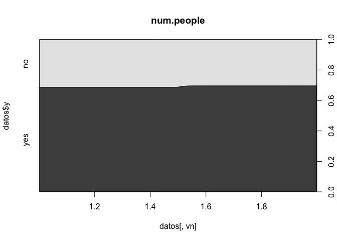<!-- -->

## Establecer categorias de referencia en variables categoricas

``` r
##-- La instruccion relevel cambia la categoria de referencia en las variables categoricas
##-- Se escoge la referencia no por criterios estadisticos, sino de interpretabilidad
datos$status <- relevel(datos$status,ref="no checking account")
datos$credit.hist <- relevel(datos$credit.hist,ref="no credits taken/all credits paid back duly")
datos$purpose <- relevel(datos$purpose,ref="others")
datos$savings <- relevel(datos$savings,ref="unknown/no savings account")
datos$employed.time <- relevel(datos$employed.time,ref="unemployed")
datos$status.sex <- relevel(datos$status.sex,ref="male:single")
datos$debtors <- relevel(datos$debtors,ref="none")
datos$property <- relevel(datos$property,ref="unknown/no property")
datos$installment2 <- relevel(datos$installment2,ref="none")
datos$housing <- relevel(datos$housing,ref="for free")
datos$job <- relevel(datos$job,ref="unskilled - resident")
datos$telephone <- relevel(datos$telephone,ref="none")
datos$foreign <- relevel(datos$foreign,ref="no")
```

## Estimar modelos con todas las variables

``` r
##-- Modelo completo
mod.glm0 <- glm(y~.,datos,family=binomial)    # estimacion del modelo
summary(mod.glm0)                             # resumen del modelo
```

    ## 
    ## Call:
    ## glm(formula = y ~ ., family = binomial, data = datos)
    ## 
    ## Deviance Residuals: 
    ##     Min       1Q   Median       3Q      Max  
    ## -2.5595  -0.6899   0.3450   0.6747   2.2623  
    ## 
    ## Coefficients:
    ##                                                             Estimate Std. Error
    ## (Intercept)                                                6.140e+00  1.830e+00
    ## status< 0 DM                                              -2.079e+00  2.883e-01
    ## status>= 200 DM                                           -6.654e-01  4.624e-01
    ## status0 <=  and < 200 DM                                  -1.431e+00  2.870e-01
    ## duration                                                  -2.740e-02  1.146e-02
    ## credit.histall credits at this bank paid back duly        -7.166e-01  6.813e-01
    ## credit.histcritical account                                1.071e+00  5.609e-01
    ## credit.histdelay in paying off in the past                 1.081e-01  5.928e-01
    ## credit.histexisting credits paid back duly till now        3.811e-01  5.487e-01
    ## purposebusiness                                           -9.650e-01  9.765e-01
    ## purposecar (new)                                          -1.902e+00  9.453e-01
    ## purposecar (used)                                          1.433e-01  9.867e-01
    ## purposedomestic appliances                                -8.175e-01  1.245e+00
    ## purposeeducation                                          -1.470e+00  1.017e+00
    ## purposefurniture/equipment                                -1.107e+00  9.505e-01
    ## purposeradio/television                                   -8.169e-01  9.510e-01
    ## purposerepairs                                            -2.086e+00  1.137e+00
    ## purposeretraining                                          7.164e-01  1.633e+00
    ## credit.amo                                                -1.092e-04  5.493e-05
    ## savings< 100 DM                                           -1.488e+00  3.311e-01
    ## savings>= 1000 DM                                          5.918e-01  8.852e-01
    ## savings100 <=  and < 500 DM                               -1.003e+00  4.438e-01
    ## savings500 <=  and < 1000 DM                              -1.527e+00  5.366e-01
    ## employed.time< 1 year                                     -3.885e-02  5.538e-01
    ## employed.time>= 7 years                                   -1.228e-01  5.345e-01
    ## employed.time1 <=  and < 4 years                           1.851e-01  5.351e-01
    ## employed.time4 <=  and < 7 years                           6.396e-01  5.696e-01
    ## installment                                               -2.094e-01  1.095e-01
    ## status.sexfemale:divorced/separated/married               -4.506e-01  2.611e-01
    ## status.sexmale:divorced/separated                         -4.108e-01  4.599e-01
    ## status.sexmale:married/widowed                            -4.753e-01  3.755e-01
    ## debtorsco-applicant                                        2.809e-01  6.124e-01
    ## debtorsguarantor                                           1.539e+00  5.503e-01
    ## residence.time                                            -2.777e-02  1.061e-01
    ## propertybuilding society savings agreement/life insurance  4.165e-01  5.158e-01
    ## propertycar or other                                       2.482e-01  5.034e-01
    ## propertyreal estate                                        3.490e-01  5.373e-01
    ## age                                                        2.178e-02  1.187e-02
    ## installment2bank                                          -6.429e-01  3.006e-01
    ## installment2stores                                        -3.880e-01  4.436e-01
    ## housingown                                                 2.801e-01  5.830e-01
    ## housingrent                                                6.662e-02  6.140e-01
    ## num.credits                                               -6.592e-02  2.350e-01
    ## jobmanagement/self-employed/                               2.959e-01  4.323e-01
    ## jobskilled employee/official                               8.781e-03  2.864e-01
    ## jobunemployed/unskilled - non-resident                     5.731e-01  7.987e-01
    ## num.people                                                -1.039e-01  3.158e-01
    ## telephoneyes                                               1.786e-01  2.427e-01
    ## foreignyes                                                -1.746e+00  8.023e-01
    ##                                                           z value Pr(>|z|)    
    ## (Intercept)                                                 3.355 0.000793 ***
    ## status< 0 DM                                               -7.211 5.55e-13 ***
    ## status>= 200 DM                                            -1.439 0.150205    
    ## status0 <=  and < 200 DM                                   -4.985 6.19e-07 ***
    ## duration                                                   -2.391 0.016785 *  
    ## credit.histall credits at this bank paid back duly         -1.052 0.292913    
    ## credit.histcritical account                                 1.910 0.056192 .  
    ## credit.histdelay in paying off in the past                  0.182 0.855330    
    ## credit.histexisting credits paid back duly till now         0.695 0.487315    
    ## purposebusiness                                            -0.988 0.323058    
    ## purposecar (new)                                           -2.012 0.044206 *  
    ## purposecar (used)                                           0.145 0.884535    
    ## purposedomestic appliances                                 -0.656 0.511570    
    ## purposeeducation                                           -1.446 0.148155    
    ## purposefurniture/equipment                                 -1.165 0.244129    
    ## purposeradio/television                                    -0.859 0.390387    
    ## purposerepairs                                             -1.834 0.066588 .  
    ## purposeretraining                                           0.439 0.660811    
    ## credit.amo                                                 -1.987 0.046903 *  
    ## savings< 100 DM                                            -4.495 6.96e-06 ***
    ## savings>= 1000 DM                                           0.668 0.503820    
    ## savings100 <=  and < 500 DM                                -2.260 0.023841 *  
    ## savings500 <=  and < 1000 DM                               -2.846 0.004427 ** 
    ## employed.time< 1 year                                      -0.070 0.944075    
    ## employed.time>= 7 years                                    -0.230 0.818273    
    ## employed.time1 <=  and < 4 years                            0.346 0.729348    
    ## employed.time4 <=  and < 7 years                            1.123 0.261517    
    ## installment                                                -1.913 0.055722 .  
    ## status.sexfemale:divorced/separated/married                -1.726 0.084337 .  
    ## status.sexmale:divorced/separated                          -0.893 0.371726    
    ## status.sexmale:married/widowed                             -1.266 0.205585    
    ## debtorsco-applicant                                         0.459 0.646430    
    ## debtorsguarantor                                            2.796 0.005175 ** 
    ## residence.time                                             -0.262 0.793463    
    ## propertybuilding society savings agreement/life insurance   0.808 0.419373    
    ## propertycar or other                                        0.493 0.621931    
    ## propertyreal estate                                         0.649 0.516029    
    ## age                                                         1.835 0.066515 .  
    ## installment2bank                                           -2.139 0.032463 *  
    ## installment2stores                                         -0.875 0.381777    
    ## housingown                                                  0.480 0.630942    
    ## housingrent                                                 0.109 0.913597    
    ## num.credits                                                -0.280 0.779099    
    ## jobmanagement/self-employed/                                0.684 0.493677    
    ## jobskilled employee/official                                0.031 0.975543    
    ## jobunemployed/unskilled - non-resident                      0.717 0.473075    
    ## num.people                                                 -0.329 0.742079    
    ## telephoneyes                                                0.736 0.461856    
    ## foreignyes                                                 -2.176 0.029556 *  
    ## ---
    ## Signif. codes:  0 '***' 0.001 '**' 0.01 '*' 0.05 '.' 0.1 ' ' 1
    ## 
    ## (Dispersion parameter for binomial family taken to be 1)
    ## 
    ##     Null deviance: 852.29  on 686  degrees of freedom
    ## Residual deviance: 604.65  on 638  degrees of freedom
    ## AIC: 702.65
    ## 
    ## Number of Fisher Scoring iterations: 5

## Seleccion automatica

``` r
##-- Missings
apply(apply(datos,2,is.na),2,sum)             # cuantos missings tiene cada variable --> Step no se puede aplicar con missings
```

    ##         status       duration    credit.hist        purpose     credit.amo 
    ##              0              0              0              0              0 
    ##        savings  employed.time    installment     status.sex        debtors 
    ##              0              0              0              0              0 
    ## residence.time       property            age   installment2        housing 
    ##              0              0              0              0              0 
    ##    num.credits            job     num.people      telephone        foreign 
    ##              0              0              0              0              0 
    ##              y 
    ##              0

``` r
##-- Funcion step (requiere que no haya missings si ha de quitar una variable que tenga)
mod.glm1 <- step(mod.glm0)
```

    ## Start:  AIC=702.65
    ## y ~ status + duration + credit.hist + purpose + credit.amo + 
    ##     savings + employed.time + installment + status.sex + debtors + 
    ##     residence.time + property + age + installment2 + housing + 
    ##     num.credits + job + num.people + telephone + foreign
    ## 
    ##                  Df Deviance    AIC
    ## - property        3   605.47 697.47
    ## - job             3   605.67 697.67
    ## - housing         2   605.36 699.36
    ## - employed.time   4   610.06 700.06
    ## - status.sex      3   608.35 700.35
    ## - residence.time  1   604.72 700.72
    ## - num.credits     1   604.73 700.73
    ## - num.people      1   604.76 700.76
    ## - telephone       1   605.19 701.19
    ## <none>                604.65 702.65
    ## - installment2    2   609.46 703.46
    ## - age             1   608.12 704.12
    ## - installment     1   608.37 704.37
    ## - credit.amo      1   608.69 704.69
    ## - duration        1   610.40 706.40
    ## - foreign         1   611.15 707.15
    ## - debtors         2   613.79 707.79
    ## - credit.hist     4   619.30 709.30
    ## - purpose         9   638.17 718.17
    ## - savings         4   635.40 725.40
    ## - status          3   668.49 760.49
    ## 
    ## Step:  AIC=697.47
    ## y ~ status + duration + credit.hist + purpose + credit.amo + 
    ##     savings + employed.time + installment + status.sex + debtors + 
    ##     residence.time + age + installment2 + housing + num.credits + 
    ##     job + num.people + telephone + foreign
    ## 
    ##                  Df Deviance    AIC
    ## - job             3   606.26 692.26
    ## - employed.time   4   610.95 694.95
    ## - status.sex      3   609.13 695.13
    ## - num.credits     1   605.53 695.53
    ## - residence.time  1   605.56 695.56
    ## - num.people      1   605.56 695.56
    ## - housing         2   607.79 695.79
    ## - telephone       1   605.97 695.97
    ## <none>                605.47 697.47
    ## - installment2    2   610.55 698.55
    ## - age             1   609.07 699.07
    ## - installment     1   609.48 699.48
    ## - credit.amo      1   609.97 699.97
    ## - duration        1   611.69 701.69
    ## - foreign         1   611.97 701.97
    ## - debtors         2   615.05 703.05
    ## - credit.hist     4   620.72 704.72
    ## - purpose         9   639.61 713.61
    ## - savings         4   637.02 721.02
    ## - status          3   670.11 756.11
    ## 
    ## Step:  AIC=692.26
    ## y ~ status + duration + credit.hist + purpose + credit.amo + 
    ##     savings + employed.time + installment + status.sex + debtors + 
    ##     residence.time + age + installment2 + housing + num.credits + 
    ##     num.people + telephone + foreign
    ## 
    ##                  Df Deviance    AIC
    ## - employed.time   4   611.64 689.64
    ## - status.sex      3   609.80 689.80
    ## - num.credits     1   606.32 690.32
    ## - num.people      1   606.37 690.37
    ## - residence.time  1   606.43 690.43
    ## - housing         2   608.50 690.50
    ## - telephone       1   607.08 691.08
    ## <none>                606.26 692.26
    ## - installment2    2   611.36 693.36
    ## - installment     1   610.05 694.05
    ## - age             1   610.22 694.22
    ## - credit.amo      1   610.54 694.54
    ## - foreign         1   612.74 696.74
    ## - duration        1   612.82 696.82
    ## - debtors         2   615.52 697.52
    ## - credit.hist     4   621.31 699.31
    ## - purpose         9   640.94 708.94
    ## - savings         4   638.22 716.22
    ## - status          3   670.63 750.63
    ## 
    ## Step:  AIC=689.64
    ## y ~ status + duration + credit.hist + purpose + credit.amo + 
    ##     savings + installment + status.sex + debtors + residence.time + 
    ##     age + installment2 + housing + num.credits + num.people + 
    ##     telephone + foreign
    ## 
    ##                  Df Deviance    AIC
    ## - num.credits     1   611.73 687.73
    ## - num.people      1   611.82 687.82
    ## - residence.time  1   611.82 687.82
    ## - status.sex      3   616.02 688.02
    ## - housing         2   614.18 688.18
    ## - telephone       1   612.58 688.58
    ## <none>                611.64 689.64
    ## - age             1   614.74 690.74
    ## - installment2    2   617.11 691.11
    ## - credit.amo      1   615.83 691.83
    ## - installment     1   616.11 692.11
    ## - duration        1   617.58 693.58
    ## - foreign         1   618.02 694.02
    ## - debtors         2   622.31 696.31
    ## - credit.hist     4   626.65 696.65
    ## - purpose         9   645.62 705.62
    ## - savings         4   643.62 713.62
    ## - status          3   675.74 747.74
    ## 
    ## Step:  AIC=687.73
    ## y ~ status + duration + credit.hist + purpose + credit.amo + 
    ##     savings + installment + status.sex + debtors + residence.time + 
    ##     age + installment2 + housing + num.people + telephone + foreign
    ## 
    ##                  Df Deviance    AIC
    ## - residence.time  1   611.93 685.93
    ## - num.people      1   611.95 685.95
    ## - status.sex      3   616.09 686.09
    ## - housing         2   614.21 686.21
    ## - telephone       1   612.63 686.63
    ## <none>                611.73 687.73
    ## - age             1   614.80 688.80
    ## - installment2    2   617.31 689.31
    ## - credit.amo      1   615.91 689.91
    ## - installment     1   616.15 690.15
    ## - duration        1   617.64 691.64
    ## - foreign         1   618.22 692.22
    ## - debtors         2   622.38 694.38
    ## - credit.hist     4   627.68 695.68
    ## - purpose         9   646.14 704.14
    ## - savings         4   643.71 711.71
    ## - status          3   675.78 745.78
    ## 
    ## Step:  AIC=685.93
    ## y ~ status + duration + credit.hist + purpose + credit.amo + 
    ##     savings + installment + status.sex + debtors + age + installment2 + 
    ##     housing + num.people + telephone + foreign
    ## 
    ##                Df Deviance    AIC
    ## - num.people    1   612.17 684.17
    ## - status.sex    3   616.24 684.24
    ## - housing       2   614.75 684.75
    ## - telephone     1   612.80 684.80
    ## <none>              611.93 685.93
    ## - age           1   614.81 686.81
    ## - installment2  2   617.46 687.46
    ## - credit.amo    1   616.09 688.09
    ## - installment   1   616.49 688.49
    ## - duration      1   617.88 689.88
    ## - foreign       1   618.59 690.59
    ## - debtors       2   622.68 692.68
    ## - credit.hist   4   627.68 693.68
    ## - purpose       9   646.22 702.22
    ## - savings       4   643.71 709.71
    ## - status        3   676.29 744.29
    ## 
    ## Step:  AIC=684.17
    ## y ~ status + duration + credit.hist + purpose + credit.amo + 
    ##     savings + installment + status.sex + debtors + age + installment2 + 
    ##     housing + telephone + foreign
    ## 
    ##                Df Deviance    AIC
    ## - status.sex    3   616.25 682.25
    ## - telephone     1   613.05 683.05
    ## - housing       2   615.14 683.14
    ## <none>              612.17 684.17
    ## - age           1   614.96 684.96
    ## - installment2  2   617.76 685.76
    ## - credit.amo    1   616.22 686.22
    ## - installment   1   616.54 686.54
    ## - duration      1   618.02 688.02
    ## - foreign       1   618.76 688.76
    ## - debtors       2   622.78 690.78
    ## - credit.hist   4   628.13 692.13
    ## - purpose       9   646.71 700.71
    ## - savings       4   643.86 707.86
    ## - status        3   676.71 742.71
    ## 
    ## Step:  AIC=682.25
    ## y ~ status + duration + credit.hist + purpose + credit.amo + 
    ##     savings + installment + debtors + age + installment2 + housing + 
    ##     telephone + foreign
    ## 
    ##                Df Deviance    AIC
    ## - telephone     1   616.95 680.95
    ## - housing       2   619.42 681.42
    ## <none>              616.25 682.25
    ## - credit.amo    1   619.28 683.28
    ## - installment2  2   621.52 683.52
    ## - installment   1   619.60 683.60
    ## - age           1   620.36 684.36
    ## - duration      1   622.32 686.32
    ## - foreign       1   623.44 687.44
    ## - debtors       2   626.36 688.36
    ## - credit.hist   4   631.76 689.76
    ## - purpose       9   650.38 698.38
    ## - savings       4   647.37 705.37
    ## - status        3   681.37 741.37
    ## 
    ## Step:  AIC=680.95
    ## y ~ status + duration + credit.hist + purpose + credit.amo + 
    ##     savings + installment + debtors + age + installment2 + housing + 
    ##     foreign
    ## 
    ##                Df Deviance    AIC
    ## - housing       2   620.05 680.05
    ## <none>              616.95 680.95
    ## - credit.amo    1   619.49 681.49
    ## - installment   1   620.02 682.02
    ## - installment2  2   622.29 682.29
    ## - age           1   621.62 683.62
    ## - duration      1   623.32 685.32
    ## - foreign       1   623.78 685.78
    ## - debtors       2   626.84 686.84
    ## - credit.hist   4   632.82 688.82
    ## - purpose       9   651.93 697.93
    ## - savings       4   648.02 704.02
    ## - status        3   682.64 740.64
    ## 
    ## Step:  AIC=680.05
    ## y ~ status + duration + credit.hist + purpose + credit.amo + 
    ##     savings + installment + debtors + age + installment2 + foreign
    ## 
    ##                Df Deviance    AIC
    ## <none>              620.05 680.05
    ## - credit.amo    1   623.17 681.17
    ## - installment2  2   625.23 681.23
    ## - installment   1   623.35 681.35
    ## - age           1   624.24 682.24
    ## - duration      1   626.83 684.83
    ## - foreign       1   626.96 684.96
    ## - debtors       2   631.02 687.02
    ## - credit.hist   4   637.09 689.09
    ## - purpose       9   654.05 696.05
    ## - savings       4   650.78 702.78
    ## - status        3   689.36 743.36

``` r
summary(mod.glm1)
```

    ## 
    ## Call:
    ## glm(formula = y ~ status + duration + credit.hist + purpose + 
    ##     credit.amo + savings + installment + debtors + age + installment2 + 
    ##     foreign, family = binomial, data = datos)
    ## 
    ## Deviance Residuals: 
    ##     Min       1Q   Median       3Q      Max  
    ## -2.7167  -0.7183   0.3700   0.6981   2.2348  
    ## 
    ## Coefficients:
    ##                                                       Estimate Std. Error
    ## (Intercept)                                          6.344e+00  1.454e+00
    ## status< 0 DM                                        -2.086e+00  2.769e-01
    ## status>= 200 DM                                     -7.040e-01  4.470e-01
    ## status0 <=  and < 200 DM                            -1.434e+00  2.758e-01
    ## duration                                            -2.832e-02  1.093e-02
    ## credit.histall credits at this bank paid back duly  -6.783e-01  6.391e-01
    ## credit.histcritical account                          1.077e+00  5.433e-01
    ## credit.histdelay in paying off in the past           1.595e-01  5.768e-01
    ## credit.histexisting credits paid back duly till now  3.814e-01  5.152e-01
    ## purposebusiness                                     -8.553e-01  9.157e-01
    ## purposecar (new)                                    -1.922e+00  8.880e-01
    ## purposecar (used)                                   -2.832e-02  9.326e-01
    ## purposedomestic appliances                          -7.965e-01  1.179e+00
    ## purposeeducation                                    -1.582e+00  9.588e-01
    ## purposefurniture/equipment                          -1.162e+00  8.931e-01
    ## purposeradio/television                             -8.403e-01  8.927e-01
    ## purposerepairs                                      -2.129e+00  1.090e+00
    ## purposeretraining                                    5.313e-01  1.515e+00
    ## credit.amo                                          -8.735e-05  4.992e-05
    ## savings< 100 DM                                     -1.462e+00  3.179e-01
    ## savings>= 1000 DM                                    4.469e-01  8.527e-01
    ## savings100 <=  and < 500 DM                         -1.028e+00  4.283e-01
    ## savings500 <=  and < 1000 DM                        -1.465e+00  5.253e-01
    ## installment                                         -1.845e-01  1.022e-01
    ## debtorsco-applicant                                  3.946e-01  5.993e-01
    ## debtorsguarantor                                     1.595e+00  5.304e-01
    ## age                                                  1.932e-02  9.557e-03
    ## installment2bank                                    -6.510e-01  2.909e-01
    ## installment2stores                                  -3.488e-01  4.211e-01
    ## foreignyes                                          -1.755e+00  7.926e-01
    ##                                                     z value Pr(>|z|)    
    ## (Intercept)                                           4.364 1.28e-05 ***
    ## status< 0 DM                                         -7.535 4.90e-14 ***
    ## status>= 200 DM                                      -1.575  0.11526    
    ## status0 <=  and < 200 DM                             -5.200 2.00e-07 ***
    ## duration                                             -2.591  0.00956 ** 
    ## credit.histall credits at this bank paid back duly   -1.061  0.28856    
    ## credit.histcritical account                           1.983  0.04733 *  
    ## credit.histdelay in paying off in the past            0.277  0.78214    
    ## credit.histexisting credits paid back duly till now   0.740  0.45906    
    ## purposebusiness                                      -0.934  0.35031    
    ## purposecar (new)                                     -2.165  0.03040 *  
    ## purposecar (used)                                    -0.030  0.97577    
    ## purposedomestic appliances                           -0.676  0.49924    
    ## purposeeducation                                     -1.650  0.09895 .  
    ## purposefurniture/equipment                           -1.301  0.19325    
    ## purposeradio/television                              -0.941  0.34656    
    ## purposerepairs                                       -1.954  0.05071 .  
    ## purposeretraining                                     0.351  0.72586    
    ## credit.amo                                           -1.750  0.08016 .  
    ## savings< 100 DM                                      -4.599 4.25e-06 ***
    ## savings>= 1000 DM                                     0.524  0.60017    
    ## savings100 <=  and < 500 DM                          -2.401  0.01635 *  
    ## savings500 <=  and < 1000 DM                         -2.790  0.00528 ** 
    ## installment                                          -1.806  0.07091 .  
    ## debtorsco-applicant                                   0.659  0.51019    
    ## debtorsguarantor                                      3.006  0.00264 ** 
    ## age                                                   2.022  0.04317 *  
    ## installment2bank                                     -2.238  0.02521 *  
    ## installment2stores                                   -0.828  0.40754    
    ## foreignyes                                           -2.215  0.02676 *  
    ## ---
    ## Signif. codes:  0 '***' 0.001 '**' 0.01 '*' 0.05 '.' 0.1 ' ' 1
    ## 
    ## (Dispersion parameter for binomial family taken to be 1)
    ## 
    ##     Null deviance: 852.29  on 686  degrees of freedom
    ## Residual deviance: 620.05  on 657  degrees of freedom
    ## AIC: 680.05
    ## 
    ## Number of Fisher Scoring iterations: 5

``` r
#install.packages('caret')
library(caret)
varImp(mod.glm1)
```

    ##                                                        Overall
    ## status< 0 DM                                        7.53465128
    ## status>= 200 DM                                     1.57497117
    ## status0 <=  and < 200 DM                            5.19956704
    ## duration                                            2.59149544
    ## credit.histall credits at this bank paid back duly  1.06128220
    ## credit.histcritical account                         1.98335700
    ## credit.histdelay in paying off in the past          0.27653676
    ## credit.histexisting credits paid back duly till now 0.74039004
    ## purposebusiness                                     0.93398331
    ## purposecar (new)                                    2.16484154
    ## purposecar (used)                                   0.03036625
    ## purposedomestic appliances                          0.67567829
    ## purposeeducation                                    1.64998666
    ## purposefurniture/equipment                          1.30102589
    ## purposeradio/television                             0.94129043
    ## purposerepairs                                      1.95396428
    ## purposeretraining                                   0.35063578
    ## credit.amo                                          1.74978501
    ## savings< 100 DM                                     4.59898716
    ## savings>= 1000 DM                                   0.52415157
    ## savings100 <=  and < 500 DM                         2.40093358
    ## savings500 <=  and < 1000 DM                        2.78968670
    ## installment                                         1.80605316
    ## debtorsco-applicant                                 0.65853689
    ## debtorsguarantor                                    3.00648918
    ## age                                                 2.02202586
    ## installment2bank                                    2.23809646
    ## installment2stores                                  0.82823855
    ## foreignyes                                          2.21498415

## Validacion

``` r
##-- Por inspeccion visual
br <- quantile(fitted(mod.glm1),seq(0,1,0.1))                                # Se crean los puntos de corte para los intervalos (br) de las probabilidades predichas
# el 10% peor de la muestar tiene una probabilidad de pagar entre un 0.04% a un 0.29%
int <- cut(fitted(mod.glm1),br)                                              # Se crea una variable con el intervalo al que pertenece cada individuo
obs <- tapply(mod.glm1$y,int,sum)                                            # Los pagos observados en cada intervalo
# de los eque el modelo ha dicho que tienen una probabilidad de pagar entre el 0.04 y un 0.29, solo 11 han acabado pagando
exp <- tapply(fitted(mod.glm1),int,sum)                                      # Los pagos esperados en cada intervalo  
plot(1:10+0.05,exp,type='h',xlab="Intervalos",ylab="Frecuencias",lwd=2)      # Grafico de los pagos esperados
lines(1:10-0.05,obs,type='h',col=2,lwd=2)                                    # Se anyade los pagos observados
legend("topleft",c("Pagan - esperados", "Pagan - observados"),lwd=2,col=1:2) # Se anyade una leyenda
```

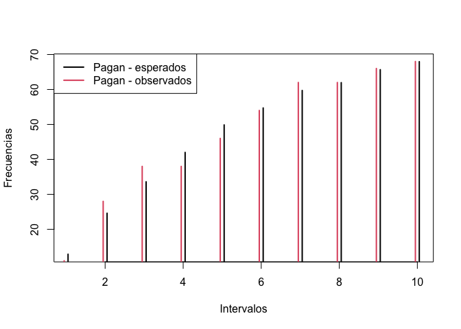<!-- -->

Vemos que en los intervalos altos coincide mucho, pero intervalos bajos
no tanto Para valores pequenos el model infraestima, aunque las
diferencias son muy pocas. El modelo esta mejor calibrado en
probabilidades altas que en pequenas

``` r
##--test de Hosmer-Lemeshow
# install.packages('ResourceSelection')
library(ResourceSelection)
hoslem.test(mod.glm1$y, fitted(mod.glm1))  # si el p-valor es inferior a 0.05 quedaria en duda el modelo
```

    ## 
    ##  Hosmer and Lemeshow goodness of fit (GOF) test
    ## 
    ## data:  mod.glm1$y, fitted(mod.glm1)
    ## X-squared = 5.0162, df = 8, p-value = 0.7558

## Estimacion de un Odds Ratio

``` r
##-- Variable categorica
exp(mod.glm1$coef["foreignyes"])    # Los extranjeros tienen un oddsratio de 0.17 respecto a los no extranjeros. Es decir, las probabilidades de pagar son un 0.17 la de los nacionales 
```

    ## foreignyes 
    ##  0.1728219

``` r
# odds extranjero / odds nacional = 0.17, las "probabilidades"/odds de pagar el credito si eres extranjero es un 17% menor que los nacionales

##-- Variable numerica
exp(mod.glm1$coef["age"])           # Por cada a?o de m?s de la persona se incrementa en un 2% (aprox) la probabilidad de que acabe pagando
```

    ##      age 
    ## 1.019513

``` r
# por cada anyo adicional que tenga el cliente las odds de acabar pagando se incrementa en un 2%

##--Intervalos de confianza
IC <- confint(mod.glm1)             # Intervalos de  confianza para los coeficientes
```

    ## Waiting for profiling to be done...

``` r
round(exp(IC),2)                    # Intervalos de confianza para los ORs redondeados a 2 decimales
```

    ##                                                     2.5 %   97.5 %
    ## (Intercept)                                         37.30 11893.80
    ## status< 0 DM                                         0.07     0.21
    ## status>= 200 DM                                      0.21     1.23
    ## status0 <=  and < 200 DM                             0.14     0.41
    ## duration                                             0.95     0.99
    ## credit.histall credits at this bank paid back duly   0.14     1.78
    ## credit.histcritical account                          1.02     8.65
    ## credit.histdelay in paying off in the past           0.38     3.69
    ## credit.histexisting credits paid back duly till now  0.53     4.08
    ## purposebusiness                                      0.06     2.40
    ## purposecar (new)                                     0.02     0.77
    ## purposecar (used)                                    0.14     5.75
    ## purposedomestic appliances                           0.04     4.58
    ## purposeeducation                                     0.03     1.26
    ## purposefurniture/equipment                           0.05     1.68
    ## purposeradio/television                              0.06     2.31
    ## purposerepairs                                       0.01     0.96
    ## purposeretraining                                    0.10    53.28
    ## credit.amo                                           1.00     1.00
    ## savings< 100 DM                                      0.12     0.42
    ## savings>= 1000 DM                                    0.35    11.41
    ## savings100 <=  and < 500 DM                          0.15     0.83
    ## savings500 <=  and < 1000 DM                         0.08     0.67
    ## installment                                          0.68     1.01
    ## debtorsco-applicant                                  0.47     4.99
    ## debtorsguarantor                                     1.85    15.16
    ## age                                                  1.00     1.04
    ## installment2bank                                     0.29     0.92
    ## installment2stores                                   0.31     1.63
    ## foreignyes                                           0.03     0.67

``` r
## status >= 200 DM, nos indica que con un 95% de confianza podemos afirmar que el hecho de tener >200DM implicará tener un odd de pagar entre 1.77 y 9.58 respecto a la variable de referencia 
```

## Estimacion de la probabilidad de pagos

``` r
##-- Probabilidades predichas
pr <- predict(mod.glm1,datos,type="response")
pr
```

    ##          1          2          3          4          5          6          7 
    ## 0.20471607 0.86816951 0.86829582 0.67400455 0.40808215 0.22112157 0.45818008 
    ##          8          9         10         11         12         13         14 
    ## 0.29401368 0.52592543 0.98552107 0.39060891 0.59369383 0.88390967 0.65882966 
    ##         15         16         17         18         19         20         21 
    ## 0.99734635 0.45761414 0.89040304 0.93676317 0.92570514 0.21616897 0.27545451 
    ##         22         23         24         25         26         27         28 
    ## 0.44367752 0.99119872 0.60402284 0.49638659 0.87690085 0.66025834 0.67655686 
    ##         29         30         31         32         33         34         35 
    ## 0.55658645 0.85653964 0.81144928 0.79606620 0.87079195 0.94149113 0.89541540 
    ##         36         37         38         39         40         41         42 
    ## 0.98746886 0.96488577 0.80056572 0.52287969 0.37592802 0.99057853 0.85967107 
    ##         43         44         45         46         47         48         49 
    ## 0.78912675 0.59286650 0.81666486 0.99111702 0.82786135 0.49430376 0.53603447 
    ##         50         51         52         53         54         55         56 
    ## 0.89601355 0.71093001 0.93029447 0.44612533 0.87598588 0.91293864 0.92864704 
    ##         57         58         59         60         61         62         63 
    ## 0.63352450 0.98664773 0.38417516 0.15157995 0.97503424 0.94519433 0.17977740 
    ##         64         65         66         67         68         69         70 
    ## 0.66004069 0.83115522 0.77999747 0.43456951 0.75469468 0.98924692 0.30696763 
    ##         71         72         73         74         75         76         77 
    ## 0.92541601 0.76625822 0.71042919 0.61528294 0.49305546 0.98595369 0.47594073 
    ##         78         79         80         81         82         83         84 
    ## 0.60817663 0.43928932 0.96130045 0.85347846 0.84628676 0.35227451 0.89643932 
    ##         85         86         87         88         89         90         91 
    ## 0.44814846 0.07379662 0.76535432 0.97817015 0.79587642 0.97366985 0.98864922 
    ##         92         93         94         95         96         97         98 
    ## 0.41018052 0.37438514 0.39917073 0.87588151 0.92848012 0.99163776 0.98924807 
    ##         99        100        101        102        103        104        105 
    ## 0.97024276 0.52490961 0.97767163 0.50109440 0.99305412 0.82075493 0.60845079 
    ##        106        107        108        109        110        111        112 
    ## 0.91265806 0.88288426 0.71644168 0.84606596 0.98422276 0.24200864 0.71741565 
    ##        113        114        115        116        117        118        119 
    ## 0.36581966 0.30957192 0.98477726 0.66661762 0.56584072 0.38687774 0.51737794 
    ##        120        121        122        123        124        125        126 
    ## 0.92450223 0.74838633 0.96862273 0.86913364 0.46003967 0.92750054 0.76279761 
    ##        127        128        129        130        131        132        133 
    ## 0.76890838 0.85906938 0.93253197 0.78134845 0.26913559 0.99924666 0.99147009 
    ##        134        135        136        137        138        139        140 
    ## 0.96358658 0.31139111 0.77694470 0.99382486 0.23122232 0.66325597 0.35685295 
    ##        141        142        143        144        145        146        147 
    ## 0.88606088 0.82449603 0.47813862 0.81105100 0.94444930 0.38203950 0.87770853 
    ##        148        149        150        151        152        153        154 
    ## 0.15990450 0.58439439 0.84875646 0.93687934 0.87951177 0.31763894 0.94529405 
    ##        155        156        157        158        159        160        161 
    ## 0.84226846 0.90666100 0.83316810 0.91726259 0.71661817 0.88858041 0.44603813 
    ##        162        163        164        165        166        167        168 
    ## 0.86092440 0.91590347 0.23442361 0.96819117 0.97699372 0.67165345 0.96076437 
    ##        169        170        171        172        173        174        175 
    ## 0.95721439 0.98094480 0.93922508 0.17997241 0.93158001 0.94144541 0.86407926 
    ##        176        177        178        179        180        181        182 
    ## 0.90091017 0.99481416 0.78379122 0.98817911 0.55964875 0.09307858 0.34978965 
    ##        183        184        185        186        187        188        189 
    ## 0.93097854 0.36148172 0.79088386 0.90091848 0.26900686 0.99285192 0.86922473 
    ##        190        191        192        193        194        195        196 
    ## 0.93975512 0.90168898 0.39503677 0.60467705 0.46613152 0.97916489 0.96825624 
    ##        197        198        199        200        201        202        203 
    ## 0.62515701 0.61954534 0.39164515 0.78154805 0.73401074 0.31321578 0.98567560 
    ##        204        205        206        207        208        209        210 
    ## 0.86033172 0.88667363 0.89104558 0.36116938 0.40437754 0.67863459 0.77376445 
    ##        211        212        213        214        215        216        217 
    ## 0.83750483 0.98573376 0.93090256 0.60216403 0.68426318 0.87126757 0.84308366 
    ##        218        219        220        221        222        223        224 
    ## 0.12780787 0.76062833 0.27268133 0.52531683 0.41789964 0.91518896 0.94806716 
    ##        225        226        227        228        229        230        231 
    ## 0.95324732 0.93141866 0.93730496 0.29352782 0.84901113 0.99567655 0.69013594 
    ##        232        233        234        235        236        237        238 
    ## 0.88727515 0.85528552 0.95831542 0.52536952 0.90407317 0.32718666 0.41868289 
    ##        239        240        241        242        243        244        245 
    ## 0.63274142 0.84770507 0.73886117 0.16968745 0.35812312 0.88302818 0.14736643 
    ##        246        247        248        249        250        251        252 
    ## 0.94162937 0.88671029 0.54738490 0.96043264 0.53499760 0.90374943 0.79432154 
    ##        253        254        255        256        257        258        259 
    ## 0.94306420 0.23527870 0.55084883 0.51662111 0.60090639 0.98957919 0.90286415 
    ##        260        261        262        263        264        265        266 
    ## 0.86459436 0.62185264 0.66394498 0.67291588 0.64939159 0.83255436 0.72220984 
    ##        267        268        269        270        271        272        273 
    ## 0.50761475 0.92646355 0.95829172 0.23755556 0.52249456 0.62432610 0.71347222 
    ##        274        275        276        277        278        279        280 
    ## 0.94439318 0.72376858 0.85109722 0.80851691 0.99194565 0.89831098 0.51721726 
    ##        281        282        283        284        285        286        287 
    ## 0.96939704 0.58409585 0.75311811 0.43731572 0.91214983 0.77268370 0.35788158 
    ##        288        289        290        291        292        293        294 
    ## 0.56475327 0.64479243 0.71641722 0.50350869 0.14651335 0.93774795 0.92125553 
    ##        295        296        297        298        299        300        301 
    ## 0.84183015 0.27358470 0.91593786 0.70695251 0.55207558 0.86075290 0.74059729 
    ##        302        303        304        305        306        307        308 
    ## 0.60158678 0.82388456 0.88753104 0.34461373 0.79081747 0.90822987 0.64315921 
    ##        309        310        311        312        313        314        315 
    ## 0.34010976 0.99440884 0.77042856 0.35766861 0.80565953 0.62578060 0.82311795 
    ##        316        317        318        319        320        321        322 
    ## 0.29550975 0.79674898 0.97209552 0.87534158 0.45617648 0.93673292 0.97042227 
    ##        323        324        325        326        327        328        329 
    ## 0.92342365 0.83559088 0.68950455 0.15849183 0.17363250 0.95945926 0.26402600 
    ##        330        331        332        333        334        335        336 
    ## 0.84126445 0.90889225 0.80576777 0.66010641 0.92247334 0.84615143 0.88755877 
    ##        337        338        339        340        341        342        343 
    ## 0.81388473 0.48388823 0.47196766 0.94374907 0.87927299 0.69509510 0.91359374 
    ##        344        345        346        347        348        349        350 
    ## 0.97239876 0.34043175 0.52564288 0.94485026 0.88811957 0.94901337 0.79942377 
    ##        351        352        353        354        355        356        357 
    ## 0.04246199 0.76895455 0.73491398 0.71666063 0.54448669 0.76319383 0.19374290 
    ##        358        359        360        361        362        363        364 
    ## 0.80255291 0.78011044 0.14208086 0.75609154 0.66321552 0.66575953 0.61888324 
    ##        365        366        367        368        369        370        371 
    ## 0.37345407 0.79564908 0.07779199 0.76130220 0.81375137 0.34892500 0.74129449 
    ##        372        373        374        375        376        377        378 
    ## 0.51052641 0.66668271 0.62736402 0.99058331 0.21033609 0.26972658 0.92887081 
    ##        379        380        381        382        383        384        385 
    ## 0.98056104 0.43987114 0.66103547 0.90134151 0.96511820 0.95527723 0.77122883 
    ##        386        387        388        389        390        391        392 
    ## 0.84998086 0.20047913 0.94204240 0.29377183 0.50566546 0.54470966 0.73609259 
    ##        393        394        395        396        397        398        399 
    ## 0.78360089 0.64878860 0.95836310 0.67079293 0.34510795 0.16798839 0.75185843 
    ##        400        401        402        403        404        405        406 
    ## 0.95736993 0.60314697 0.10526816 0.72193240 0.86743955 0.97984443 0.58454778 
    ##        407        408        409        410        411        412        413 
    ## 0.84118383 0.90690282 0.75834044 0.44548902 0.53171762 0.55844839 0.80199540 
    ##        414        415        416        417        418        419        420 
    ## 0.76016727 0.85303597 0.36464902 0.33995476 0.97918033 0.43882040 0.12087644 
    ##        421        422        423        424        425        426        427 
    ## 0.86424595 0.90979399 0.32804616 0.72786793 0.35798668 0.89249874 0.12853815 
    ##        428        429        430        431        432        433        434 
    ## 0.27852682 0.35483119 0.98230581 0.87651620 0.61593417 0.36924484 0.37172024 
    ##        435        436        437        438        439        440        441 
    ## 0.59416082 0.29830450 0.28494634 0.96192803 0.29677743 0.81839251 0.72429040 
    ##        442        443        444        445        446        447        448 
    ## 0.56199394 0.85617066 0.90500465 0.92415324 0.47671054 0.52610828 0.84772311 
    ##        449        450        451        452        453        454        455 
    ## 0.93758655 0.85758683 0.35971307 0.86793466 0.85963536 0.31735429 0.38725904 
    ##        456        457        458        459        460        461        462 
    ## 0.87867951 0.97255672 0.75778358 0.66754011 0.95785778 0.63644142 0.71626573 
    ##        463        464        465        466        467        468        469 
    ## 0.85084755 0.98147350 0.66059176 0.84904169 0.58121895 0.85418122 0.51688410 
    ##        470        471        472        473        474        475        476 
    ## 0.52831942 0.19199878 0.75762323 0.88338719 0.98636777 0.66111101 0.04790133 
    ##        477        478        479        480        481        482        483 
    ## 0.99427699 0.98067378 0.96130729 0.59601766 0.75578946 0.55184414 0.22757796 
    ##        484        485        486        487        488        489        490 
    ## 0.80901082 0.61034648 0.97749291 0.96642424 0.26919274 0.20440242 0.98352572 
    ##        491        492        493        494        495        496        497 
    ## 0.44149836 0.93385635 0.41757746 0.30227558 0.90081790 0.08232717 0.30085008 
    ##        498        499        500        501        502        503        504 
    ## 0.47909078 0.51845744 0.31210048 0.49484876 0.85259356 0.94859394 0.51241168 
    ##        505        506        507        508        509        510        511 
    ## 0.43376052 0.97883142 0.49656380 0.44372142 0.86795355 0.83261908 0.34721079 
    ##        512        513        514        515        516        517        518 
    ## 0.78730888 0.97652019 0.88729810 0.92686222 0.47673432 0.71712941 0.75115619 
    ##        519        520        521        522        523        524        525 
    ## 0.98967183 0.97730966 0.87982529 0.31599295 0.96614030 0.88360222 0.98260865 
    ##        526        527        528        529        530        531        532 
    ## 0.19702331 0.12043160 0.71191518 0.98109669 0.75802573 0.78173512 0.92347647 
    ##        533        534        535        536        537        538        539 
    ## 0.93392426 0.91597284 0.76162166 0.57334578 0.98711865 0.71098925 0.09661796 
    ##        540        541        542        543        544        545        546 
    ## 0.93799602 0.99277370 0.31274682 0.33700694 0.87572328 0.48861056 0.37499756 
    ##        547        548        549        550        551        552        553 
    ## 0.11378086 0.96877848 0.46842165 0.28242013 0.75360064 0.78087856 0.22715305 
    ##        554        555        556        557        558        559        560 
    ## 0.33233366 0.29761346 0.81189895 0.62522479 0.83921697 0.19619269 0.12671585 
    ##        561        562        563        564        565        566        567 
    ## 0.88229331 0.80997472 0.14455635 0.96708288 0.91985586 0.95264302 0.19943050 
    ##        568        569        570        571        572        573        574 
    ## 0.88497462 0.60013436 0.58766489 0.74204950 0.85058510 0.94746690 0.64563253 
    ##        575        576        577        578        579        580        581 
    ## 0.54843166 0.88415980 0.08982208 0.47371238 0.75224382 0.89363383 0.99406036 
    ##        582        583        584        585        586        587        588 
    ## 0.99082172 0.82268605 0.40780490 0.79133608 0.85085491 0.33134391 0.92450748 
    ##        589        590        591        592        593        594        595 
    ## 0.93146585 0.69727997 0.97703361 0.96764552 0.91406869 0.75715907 0.97619676 
    ##        596        597        598        599        600        601        602 
    ## 0.90873384 0.98219321 0.96360266 0.53873804 0.19240106 0.97257700 0.50714532 
    ##        603        604        605        606        607        608        609 
    ## 0.94931584 0.68279199 0.78898633 0.98264306 0.93184491 0.39223286 0.99825721 
    ##        610        611        612        613        614        615        616 
    ## 0.95232754 0.55588849 0.96623887 0.97388580 0.86224451 0.54050045 0.90743596 
    ##        617        618        619        620        621        622        623 
    ## 0.68197755 0.82240124 0.49440482 0.16964739 0.98537184 0.18343845 0.56487386 
    ##        624        625        626        627        628        629        630 
    ## 0.33258701 0.89814085 0.51970026 0.41653027 0.11535905 0.07861878 0.50554601 
    ##        631        632        633        634        635        636        637 
    ## 0.23169758 0.97068146 0.78639526 0.62712991 0.87502554 0.30282509 0.48025647 
    ##        638        639        640        641        642        643        644 
    ## 0.83636768 0.67374380 0.15667891 0.99246247 0.95112964 0.92820852 0.80523234 
    ##        645        646        647        648        649        650        651 
    ## 0.92088050 0.91177828 0.78762957 0.31697101 0.72920828 0.53303158 0.60135208 
    ##        652        653        654        655        656        657        658 
    ## 0.94061854 0.94336750 0.87213086 0.20956320 0.55960980 0.96276837 0.46331565 
    ##        659        660        661        662        663        664        665 
    ## 0.91044678 0.77677582 0.40298732 0.81160091 0.65648988 0.83001883 0.92453380 
    ##        666        667        668        669        670        671        672 
    ## 0.75087623 0.89720129 0.84796036 0.96953631 0.85941292 0.65306339 0.64649287 
    ##        673        674        675        676        677        678        679 
    ## 0.57524800 0.91652455 0.53765724 0.52427336 0.49033886 0.78366566 0.97766277 
    ##        680        681        682        683        684        685        686 
    ## 0.67872113 0.80844515 0.22029268 0.93861494 0.56014565 0.90499576 0.24087753 
    ##        687 
    ## 0.81295097

``` r
##--Probabilidad maxima y minima
pos.max <- which.max(pr)        # posicion del individuo con mayor probabilidad de pagar
pr[pos.max]                     # probabilidad de dicho individuo 
```

    ##       132 
    ## 0.9992467

``` r
datos$y[pos.max]                # pago?
```

    ## [1] yes
    ## Levels: no yes

``` r
pos.min <- which.min(pr)        # posicion del individuo con menor probabilidad de pagar
pr[pos.min]                     # probabilidad de dicho individuo 
```

    ##        351 
    ## 0.04246199

``` r
datos$y[pos.min]                # pago?
```

    ## [1] no
    ## Levels: no yes

``` r
boxplot(pr~y,datos)
```

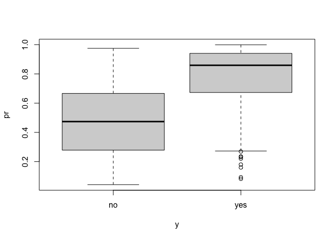<!-- -->

``` r
## el modelo es bueno, o algo bueno ya que los boxplots son diferentes. Nos interesa que sean aun mas diferentes. lo que significa que el modelo aun discrimina mas.
```

## Curva ROC y AUC

``` r
##-- Instalar libreria AUC
# install.packages('AUC')
library(AUC)

##-- Curva ROC y AUC
pr <- predict(mod.glm1,type='response')
roc.curve <- roc(pr,datos$y)
plot(roc.curve)
```

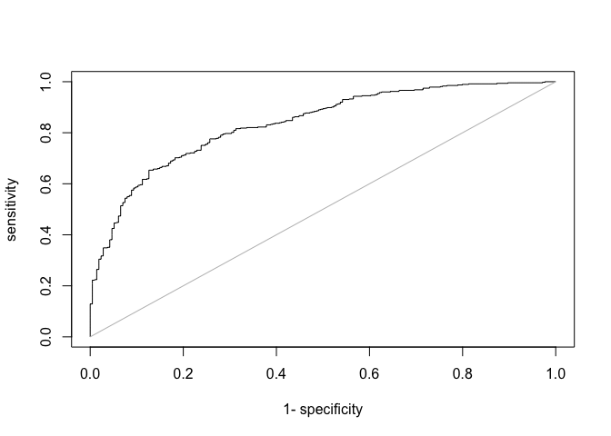<!-- -->

``` r
AUC::auc(roc.curve)
```

    ## [1] 0.8361028

No la curva podria ser mas abombada pero no está mal. 0.83, una
capacidad predictiva muy buena.

## Calibracion del modelo

``` r
# install.packages('PresenceAbsence')
library(PresenceAbsence)
```

    ## 
    ## Attaching package: 'PresenceAbsence'

    ## The following objects are masked from 'package:AUC':
    ## 
    ##     auc, sensitivity, specificity

    ## The following objects are masked from 'package:caret':
    ## 
    ##     sensitivity, specificity

``` r
df.calibra <- data.frame(plotID=1:nrow(datos), Observed = as.numeric(datos$y)-1  , Predicted1 = pr)
calibration.plot(df.calibra, N.bins = 10,ylab='Observed probabilities')
```

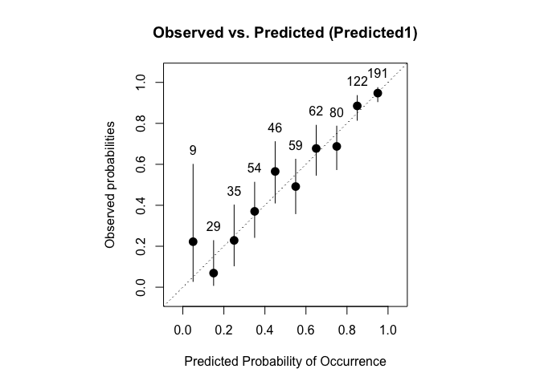<!-- -->

    ##    BinCenter NBin     BinObs    BinPred BinObsCIlower BinObsCIupper
    ## 1       0.05    9 0.22222222 0.07582405   0.028144973     0.6000936
    ## 2       0.15   29 0.06896552 0.15727184   0.008463962     0.2276619
    ## 3       0.25   35 0.22857143 0.25351700   0.104210432     0.4013633
    ## 4       0.35   54 0.37037037 0.34892179   0.242906996     0.5125826
    ## 5       0.45   46 0.56521739 0.45472346   0.411071365     0.7106567
    ## 6       0.55   59 0.49152542 0.54336462   0.358912728     0.6250175
    ## 7       0.65   62 0.67741935 0.64643588   0.546639848     0.7906049
    ## 8       0.75   80 0.68750000 0.75654675   0.574110926     0.7865254
    ## 9       0.85  122 0.88524590 0.85475541   0.814961512     0.9358231
    ## 10      0.95  191 0.94764398 0.95383828   0.905825051     0.9746109

``` r
detach('package:PresenceAbsence')
```

# 2\. Testear resultados

``` r
test <- read.table('bank0_test.txt',header=TRUE,sep=';', stringsAsFactors = TRUE)
```

## Calcular predicciones y compararlas con valores reales

``` r
pr <- predict(mod.glm1,test)   # probabilidades predichas
boxplot(pr~test$y)             # Como son estas probabilidades en ambos grupos de respuesta
```

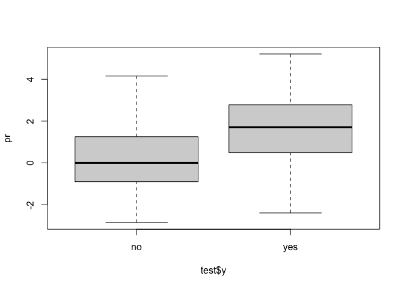<!-- -->

``` r
roc.curve <- roc(pr,test$y)    # Calculo de la curva ROC
plot(roc.curve)                # Dibujo de la curva ROC
```

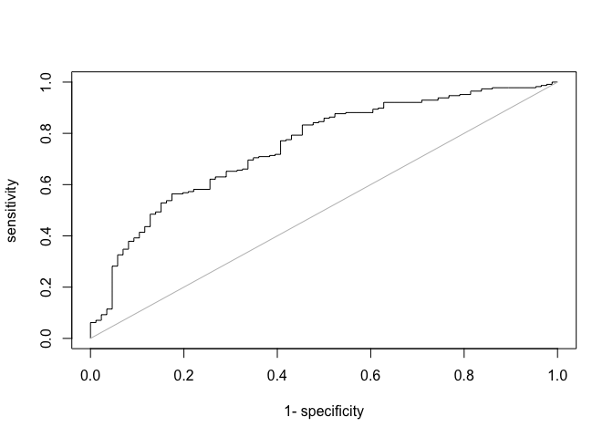<!-- -->

``` r
AUC::auc(roc.curve)                 # AUC de la curva ROC
```

    ## [1] 0.7494621

``` r
##-- Sensibilidad y especificidad para un punto de corte concreto
s <- sensitivity(pr,test$y)
e <- specificity(pr,test$y)
a <- accuracy(pr,test$y)
```

    ## Warning in mean(as.integer(as.character(labels))): NAs introduced by coercion

``` r
df <- data.frame(cutpoints=s$cutoffs,sens=s$measure,esp=e$measure,acc=a$measure)
round(df,3)
```

    ##     cutpoints  sens   esp   acc
    ## 1       1.000 0.000 1.000 0.275
    ## 2       1.000 0.004 1.000 0.278
    ## 3       0.997 0.009 1.000 0.281
    ## 4       0.994 0.013 1.000 0.284
    ## 5       0.990 0.018 1.000 0.288
    ## 6       0.987 0.022 1.000 0.291
    ## 7       0.984 0.026 1.000 0.294
    ## 8       0.981 0.031 1.000 0.297
    ## 9       0.978 0.035 1.000 0.300
    ## 10      0.974 0.040 1.000 0.304
    ## 11      0.971 0.044 1.000 0.307
    ## 12      0.968 0.048 1.000 0.310
    ## 13      0.965 0.053 1.000 0.313
    ## 14      0.962 0.057 1.000 0.316
    ## 15      0.958 0.062 1.000 0.319
    ## 16      0.955 0.062 0.988 0.316
    ## 17      0.952 0.066 0.988 0.319
    ## 18      0.949 0.070 0.988 0.323
    ## 19      0.946 0.070 0.977 0.319
    ## 20      0.942 0.075 0.977 0.323
    ## 21      0.939 0.079 0.977 0.326
    ## 22      0.936 0.084 0.977 0.329
    ## 23      0.933 0.088 0.977 0.332
    ## 24      0.930 0.093 0.977 0.335
    ## 25      0.927 0.093 0.965 0.332
    ## 26      0.923 0.097 0.965 0.335
    ## 27      0.920 0.101 0.965 0.339
    ## 28      0.917 0.106 0.965 0.342
    ## 29      0.914 0.110 0.965 0.345
    ## 30      0.911 0.115 0.965 0.348
    ## 31      0.907 0.115 0.953 0.345
    ## 32      0.904 0.119 0.953 0.348
    ## 33      0.901 0.123 0.953 0.351
    ## 34      0.898 0.128 0.953 0.355
    ## 35      0.895 0.132 0.953 0.358
    ## 36      0.891 0.137 0.953 0.361
    ## 37      0.888 0.141 0.953 0.364
    ## 38      0.885 0.145 0.953 0.367
    ## 39      0.882 0.150 0.953 0.371
    ## 40      0.879 0.154 0.953 0.374
    ## 41      0.875 0.159 0.953 0.377
    ## 42      0.872 0.163 0.953 0.380
    ## 43      0.869 0.167 0.953 0.383
    ## 44      0.866 0.172 0.953 0.387
    ## 45      0.863 0.176 0.953 0.390
    ## 46      0.859 0.181 0.953 0.393
    ## 47      0.856 0.185 0.953 0.396
    ## 48      0.853 0.189 0.953 0.399
    ## 49      0.850 0.194 0.953 0.403
    ## 50      0.847 0.198 0.953 0.406
    ## 51      0.843 0.203 0.953 0.409
    ## 52      0.840 0.207 0.953 0.412
    ## 53      0.837 0.211 0.953 0.415
    ## 54      0.834 0.216 0.953 0.419
    ## 55      0.831 0.220 0.953 0.422
    ## 56      0.827 0.225 0.953 0.425
    ## 57      0.824 0.229 0.953 0.428
    ## 58      0.821 0.233 0.953 0.431
    ## 59      0.818 0.238 0.953 0.435
    ## 60      0.815 0.242 0.953 0.438
    ## 61      0.812 0.247 0.953 0.441
    ## 62      0.808 0.251 0.953 0.444
    ## 63      0.805 0.256 0.953 0.447
    ## 64      0.802 0.260 0.953 0.450
    ## 65      0.799 0.264 0.953 0.454
    ## 66      0.796 0.269 0.953 0.457
    ## 67      0.792 0.273 0.953 0.460
    ## 68      0.789 0.278 0.953 0.463
    ## 69      0.786 0.282 0.953 0.466
    ## 70      0.783 0.282 0.942 0.463
    ## 71      0.780 0.286 0.942 0.466
    ## 72      0.776 0.291 0.942 0.470
    ## 73      0.773 0.295 0.942 0.473
    ## 74      0.770 0.300 0.942 0.476
    ## 75      0.767 0.304 0.942 0.479
    ## 76      0.764 0.308 0.942 0.482
    ## 77      0.760 0.313 0.942 0.486
    ## 78      0.757 0.317 0.942 0.489
    ## 79      0.754 0.322 0.942 0.492
    ## 80      0.751 0.326 0.942 0.495
    ## 81      0.748 0.326 0.930 0.492
    ## 82      0.744 0.330 0.930 0.495
    ## 83      0.741 0.335 0.930 0.498
    ## 84      0.738 0.339 0.930 0.502
    ## 85      0.735 0.344 0.930 0.505
    ## 86      0.732 0.348 0.930 0.508
    ## 87      0.728 0.348 0.919 0.505
    ## 88      0.725 0.352 0.919 0.508
    ## 89      0.722 0.357 0.919 0.511
    ## 90      0.719 0.361 0.919 0.514
    ## 91      0.716 0.366 0.919 0.518
    ## 92      0.712 0.370 0.919 0.521
    ## 93      0.709 0.374 0.919 0.524
    ## 94      0.706 0.379 0.919 0.527
    ## 95      0.703 0.379 0.907 0.524
    ## 96      0.700 0.383 0.907 0.527
    ## 97      0.696 0.388 0.907 0.530
    ## 98      0.693 0.392 0.907 0.534
    ## 99      0.690 0.392 0.895 0.530
    ## 100     0.687 0.396 0.895 0.534
    ## 101     0.684 0.401 0.895 0.537
    ## 102     0.681 0.405 0.895 0.540
    ## 103     0.677 0.410 0.895 0.543
    ## 104     0.674 0.414 0.895 0.546
    ## 105     0.671 0.414 0.884 0.543
    ## 106     0.668 0.419 0.884 0.546
    ## 107     0.665 0.423 0.884 0.550
    ## 108     0.661 0.427 0.884 0.553
    ## 109     0.658 0.432 0.884 0.556
    ## 110     0.655 0.436 0.884 0.559
    ## 111     0.652 0.436 0.872 0.556
    ## 112     0.649 0.441 0.872 0.559
    ## 113     0.645 0.445 0.872 0.562
    ## 114     0.642 0.449 0.872 0.565
    ## 115     0.639 0.454 0.872 0.569
    ## 116     0.636 0.458 0.872 0.572
    ## 117     0.633 0.463 0.872 0.575
    ## 118     0.629 0.467 0.872 0.578
    ## 119     0.626 0.471 0.872 0.581
    ## 120     0.623 0.476 0.872 0.585
    ## 121     0.620 0.480 0.872 0.588
    ## 122     0.617 0.485 0.872 0.591
    ## 123     0.613 0.485 0.860 0.588
    ## 124     0.610 0.489 0.860 0.591
    ## 125     0.607 0.493 0.860 0.594
    ## 126     0.604 0.493 0.849 0.591
    ## 127     0.601 0.498 0.849 0.594
    ## 128     0.597 0.502 0.849 0.597
    ## 129     0.594 0.507 0.849 0.601
    ## 130     0.591 0.511 0.849 0.604
    ## 131     0.588 0.515 0.849 0.607
    ## 132     0.585 0.520 0.849 0.610
    ## 133     0.581 0.524 0.849 0.613
    ## 134     0.578 0.529 0.849 0.617
    ## 135     0.575 0.529 0.837 0.613
    ## 136     0.572 0.533 0.837 0.617
    ## 137     0.569 0.537 0.837 0.620
    ## 138     0.565 0.537 0.826 0.617
    ## 139     0.562 0.542 0.826 0.620
    ## 140     0.559 0.546 0.826 0.623
    ## 141     0.556 0.551 0.826 0.626
    ## 142     0.553 0.555 0.826 0.629
    ## 143     0.550 0.559 0.826 0.633
    ## 144     0.546 0.564 0.826 0.636
    ## 145     0.543 0.564 0.814 0.633
    ## 146     0.540 0.564 0.802 0.629
    ## 147     0.537 0.568 0.802 0.633
    ## 148     0.534 0.568 0.791 0.629
    ## 149     0.530 0.573 0.791 0.633
    ## 150     0.527 0.573 0.779 0.629
    ## 151     0.524 0.577 0.779 0.633
    ## 152     0.521 0.581 0.779 0.636
    ## 153     0.518 0.581 0.767 0.633
    ## 154     0.514 0.581 0.756 0.629
    ## 155     0.511 0.581 0.744 0.626
    ## 156     0.508 0.586 0.744 0.629
    ## 157     0.505 0.590 0.744 0.633
    ## 158     0.502 0.595 0.744 0.636
    ## 159     0.498 0.599 0.744 0.639
    ## 160     0.495 0.604 0.744 0.642
    ## 161     0.492 0.608 0.744 0.645
    ## 162     0.489 0.612 0.744 0.649
    ## 163     0.486 0.617 0.744 0.652
    ## 164     0.482 0.621 0.744 0.655
    ## 165     0.479 0.621 0.733 0.652
    ## 166     0.476 0.626 0.733 0.655
    ## 167     0.473 0.630 0.733 0.658
    ## 168     0.470 0.630 0.721 0.655
    ## 169     0.466 0.630 0.709 0.652
    ## 170     0.463 0.634 0.709 0.655
    ## 171     0.460 0.639 0.709 0.658
    ## 172     0.457 0.643 0.709 0.661
    ## 173     0.454 0.648 0.709 0.665
    ## 174     0.450 0.652 0.709 0.668
    ## 175     0.447 0.652 0.698 0.665
    ## 176     0.444 0.652 0.686 0.661
    ## 177     0.441 0.656 0.686 0.665
    ## 178     0.438 0.656 0.674 0.661
    ## 179     0.435 0.661 0.674 0.665
    ## 180     0.431 0.661 0.663 0.661
    ## 181     0.428 0.665 0.663 0.665
    ## 182     0.425 0.670 0.663 0.668
    ## 183     0.422 0.674 0.663 0.671
    ## 184     0.419 0.678 0.663 0.674
    ## 185     0.415 0.683 0.663 0.677
    ## 186     0.412 0.687 0.663 0.681
    ## 187     0.409 0.692 0.663 0.684
    ## 188     0.406 0.696 0.663 0.687
    ## 189     0.403 0.696 0.651 0.684
    ## 190     0.399 0.700 0.651 0.687
    ## 191     0.396 0.705 0.651 0.690
    ## 192     0.393 0.705 0.640 0.687
    ## 193     0.390 0.709 0.640 0.690
    ## 194     0.387 0.709 0.628 0.687
    ## 195     0.383 0.709 0.616 0.684
    ## 196     0.380 0.714 0.616 0.687
    ## 197     0.377 0.714 0.605 0.684
    ## 198     0.374 0.718 0.605 0.687
    ## 199     0.371 0.718 0.593 0.684
    ## 200     0.367 0.722 0.593 0.687
    ## 201     0.364 0.727 0.593 0.690
    ## 202     0.361 0.731 0.593 0.693
    ## 203     0.358 0.736 0.593 0.696
    ## 204     0.355 0.740 0.593 0.700
    ## 205     0.351 0.744 0.593 0.703
    ## 206     0.348 0.749 0.593 0.706
    ## 207     0.345 0.753 0.593 0.709
    ## 208     0.342 0.758 0.593 0.712
    ## 209     0.339 0.762 0.593 0.716
    ## 210     0.335 0.767 0.593 0.719
    ## 211     0.332 0.771 0.593 0.722
    ## 212     0.329 0.771 0.581 0.719
    ## 213     0.326 0.775 0.581 0.722
    ## 214     0.323 0.775 0.570 0.719
    ## 215     0.319 0.780 0.570 0.722
    ## 216     0.316 0.784 0.570 0.725
    ## 217     0.313 0.789 0.570 0.728
    ## 218     0.310 0.793 0.570 0.732
    ## 219     0.307 0.793 0.558 0.728
    ## 220     0.304 0.793 0.547 0.725
    ## 221     0.300 0.797 0.547 0.728
    ## 222     0.297 0.802 0.547 0.732
    ## 223     0.294 0.806 0.547 0.735
    ## 224     0.291 0.811 0.547 0.738
    ## 225     0.288 0.815 0.547 0.741
    ## 226     0.284 0.819 0.547 0.744
    ## 227     0.281 0.824 0.547 0.748
    ## 228     0.278 0.828 0.547 0.751
    ## 229     0.275 0.833 0.547 0.754
    ## 230     0.272 0.833 0.535 0.751
    ## 231     0.268 0.833 0.523 0.748
    ## 232     0.265 0.837 0.523 0.751
    ## 233     0.262 0.841 0.523 0.754
    ## 234     0.259 0.841 0.512 0.751
    ## 235     0.256 0.846 0.512 0.754
    ## 236     0.252 0.846 0.500 0.751
    ## 237     0.249 0.850 0.500 0.754
    ## 238     0.246 0.855 0.500 0.757
    ## 239     0.243 0.859 0.500 0.760
    ## 240     0.240 0.859 0.488 0.757
    ## 241     0.236 0.863 0.488 0.760
    ## 242     0.233 0.863 0.477 0.757
    ## 243     0.230 0.868 0.477 0.760
    ## 244     0.227 0.872 0.477 0.764
    ## 245     0.224 0.877 0.477 0.767
    ## 246     0.220 0.877 0.465 0.764
    ## 247     0.217 0.877 0.453 0.760
    ## 248     0.214 0.881 0.453 0.764
    ## 249     0.211 0.881 0.442 0.760
    ## 250     0.208 0.881 0.430 0.757
    ## 251     0.204 0.881 0.419 0.754
    ## 252     0.201 0.881 0.407 0.751
    ## 253     0.198 0.881 0.395 0.748
    ## 254     0.195 0.885 0.395 0.751
    ## 255     0.192 0.890 0.395 0.754
    ## 256     0.188 0.894 0.395 0.757
    ## 257     0.185 0.894 0.384 0.754
    ## 258     0.182 0.899 0.384 0.757
    ## 259     0.179 0.899 0.372 0.754
    ## 260     0.176 0.903 0.372 0.757
    ## 261     0.173 0.907 0.372 0.760
    ## 262     0.169 0.912 0.372 0.764
    ## 263     0.166 0.916 0.372 0.767
    ## 264     0.163 0.921 0.372 0.770
    ## 265     0.160 0.921 0.360 0.767
    ## 266     0.157 0.921 0.349 0.764
    ## 267     0.153 0.921 0.337 0.760
    ## 268     0.150 0.921 0.326 0.757
    ## 269     0.147 0.921 0.314 0.754
    ## 270     0.144 0.921 0.302 0.751
    ## 271     0.141 0.921 0.291 0.748
    ## 272     0.137 0.925 0.291 0.751
    ## 273     0.134 0.930 0.291 0.754
    ## 274     0.131 0.930 0.279 0.751
    ## 275     0.128 0.930 0.267 0.748
    ## 276     0.125 0.930 0.256 0.744
    ## 277     0.121 0.934 0.256 0.748
    ## 278     0.118 0.938 0.256 0.751
    ## 279     0.115 0.938 0.244 0.748
    ## 280     0.112 0.938 0.233 0.744
    ## 281     0.109 0.943 0.233 0.748
    ## 282     0.105 0.947 0.233 0.751
    ## 283     0.102 0.947 0.221 0.748
    ## 284     0.099 0.947 0.209 0.744
    ## 285     0.096 0.952 0.209 0.748
    ## 286     0.093 0.952 0.198 0.744
    ## 287     0.089 0.952 0.186 0.741
    ## 288     0.086 0.956 0.186 0.744
    ## 289     0.083 0.960 0.186 0.748
    ## 290     0.080 0.965 0.186 0.751
    ## 291     0.077 0.965 0.174 0.748
    ## 292     0.073 0.965 0.163 0.744
    ## 293     0.070 0.969 0.163 0.748
    ## 294     0.067 0.974 0.163 0.751
    ## 295     0.064 0.974 0.151 0.748
    ## 296     0.061 0.974 0.140 0.744
    ## 297     0.058 0.978 0.140 0.748
    ## 298     0.054 0.978 0.128 0.744
    ## 299     0.051 0.978 0.116 0.741
    ## 300     0.048 0.978 0.105 0.738
    ## 301     0.045 0.978 0.093 0.735
    ## 302     0.042 0.978 0.081 0.732
    ## 303     0.038 0.978 0.070 0.728
    ## 304     0.035 0.978 0.058 0.725
    ## 305     0.032 0.978 0.047 0.722
    ## 306     0.029 0.982 0.047 0.725
    ## 307     0.026 0.982 0.035 0.722
    ## 308     0.022 0.987 0.035 0.725
    ## 309     0.019 0.987 0.023 0.722
    ## 310     0.016 0.991 0.023 0.725
    ## 311     0.013 0.991 0.012 0.722
    ## 312     0.010 0.996 0.012 0.725
    ## 313     0.006 1.000 0.012 0.728
    ## 314     0.003 1.000 0.000 0.725
    ## 315     0.000 1.000 0.000    NA

``` r
##-- Escoger un punto de corte --> Matriz de confusion
test$doy.credito <- ifelse(pr>0.5,'si','no')  # Doy credito a aquellos con un probabilidad predicha de pagar superior a 0.5
with(test,table(doy.credito,y))
```

    ##            y
    ## doy.credito  no yes
    ##          no  51  60
    ##          si  35 167

``` r
with(test,round(100*prop.table(table(doy.credito,y),1),1))
```

    ##            y
    ## doy.credito   no  yes
    ##          no 45.9 54.1
    ##          si 17.3 82.7
