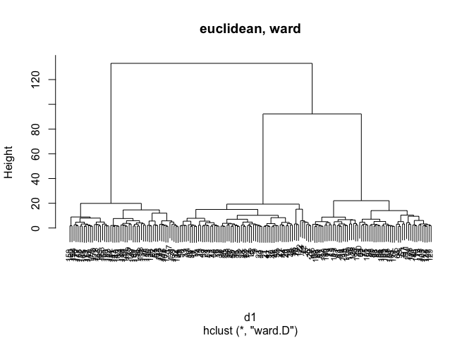
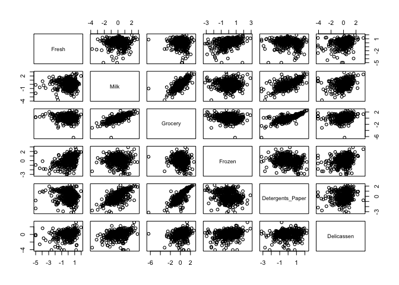

Sesion 5
================

### 2\. Haz una descriptiva de los datos sin escalar

<!-- -->

### 3\. Escala los datos y haz un heatmap

<!-- -->

### 4\. Compara los 4 dendogramas resultantes de usar la distancia euclidea/manhattan y el metodo de wald y completo

    ## The "ward" method has been renamed to "ward.D"; note new "ward.D2"
    ## The "ward" method has been renamed to "ward.D"; note new "ward.D2"

<!-- -->

### 5\. Segun los 4 dendogramas, ¿Cuantos grupos de vino crees que hay? Haz la particion segun el numero de grupos que creas conveniente para cada uno de los sistemas

  - euclidean, ward
    
        ##   [1] 1 1 1 1 1 1 1 1 1 1 1 1 1 1 1 1 1 1 1 1 1 1 1 1 1 1 1 1 1 1 1 1 1 1 1 1 1
        ##  [38] 1 1 1 1 1 1 1 1 1 1 1 1 1 2 1 1 1 1 1 1 1 1 2 3 3 2 2 2 1 2 2 3 1 2 1 2 1
        ##  [75] 2 2 2 2 1 2 2 2 2 3 2 2 2 2 2 2 2 2 2 2 2 1 3 2 2 2 2 2 2 2 2 2 2 2 2 2 2
        ## [112] 2 2 2 2 2 2 2 3 2 2 1 2 2 2 2 2 2 2 2 3 3 3 3 3 3 3 3 3 3 3 3 3 3 3 3 3 3
        ## [149] 3 3 3 3 3 3 3 3 3 3 3 3 3 3 3 3 3 3 3 3 3 3 3 3 3 3 3 3 3 3

  - euclidean, complete
    
        ##   [1] 1 1 1 1 2 1 1 1 1 1 1 1 1 1 1 2 2 2 1 1 1 1 1 1 1 2 1 1 2 1 1 1 1 2 1 1 1
        ##  [38] 1 1 1 1 1 1 1 1 1 1 1 1 1 1 1 1 2 1 1 1 1 1 1 1 1 1 2 1 1 1 2 1 1 1 2 2 2
        ##  [75] 2 1 1 1 1 2 2 2 2 3 2 2 1 2 2 2 2 2 2 2 2 1 3 2 2 2 1 2 2 2 2 2 2 2 2 2 1
        ## [112] 2 2 2 2 2 2 2 3 2 2 2 2 2 2 2 2 2 2 2 3 3 3 3 3 3 3 3 3 3 3 3 3 3 3 3 3 3
        ## [149] 3 3 3 3 3 3 3 3 3 3 3 3 3 3 3 3 3 3 3 3 3 3 3 3 3 3 3 3 3 3

  - manhattan, ward
    
        ##   [1] 1 1 1 1 2 1 1 1 1 1 1 1 1 1 1 1 1 1 1 1 1 1 1 1 1 2 1 1 2 1 1 1 1 1 1 1 1
        ##  [38] 1 1 1 1 1 1 1 1 1 1 1 1 1 1 1 1 1 1 1 1 1 1 2 3 3 2 2 2 1 2 2 3 2 3 2 2 2
        ##  [75] 2 2 2 2 2 2 2 2 2 3 2 2 2 2 2 2 2 2 2 2 2 2 2 2 2 2 2 2 2 2 2 2 2 2 2 2 2
        ## [112] 2 2 2 2 2 2 2 3 2 2 2 2 2 2 2 2 2 2 2 3 3 3 3 3 3 3 3 3 3 3 3 3 3 3 3 3 3
        ## [149] 3 3 3 3 3 3 3 3 3 3 3 3 3 3 3 3 3 3 3 3 3 3 3 3 3 3 3 3 3 3

  - manhattan, complete
    
        ##   [1] 1 1 1 1 1 1 1 1 1 1 1 1 1 1 1 1 1 1 1 1 1 1 1 1 1 1 1 1 1 1 1 1 1 1 1 1 1
        ##  [38] 1 1 1 1 1 1 1 1 1 1 1 1 1 1 1 1 1 1 1 1 1 1 2 2 2 2 2 1 1 2 2 2 2 3 1 2 1
        ##  [75] 1 2 2 3 2 1 2 2 1 3 1 2 1 1 1 1 1 1 1 2 1 2 1 2 2 1 2 2 1 2 2 1 2 1 2 1 1
        ## [112] 1 1 1 1 1 2 2 3 2 1 1 1 1 1 1 1 1 1 1 3 3 3 3 3 3 3 3 3 3 3 3 3 3 3 3 3 3
        ## [149] 3 3 3 3 3 3 3 3 3 3 3 3 3 3 3 3 3 3 3 3 3 3 3 3 3 3 3 3 3 3

### 6\. Escoge una partición de las anteriores y calcula el % de variabilidad explicada

Inercia entre (con wine)

    ## [1] 11174409

Inercia global (con wine)

    ## [1] 17592296

Varianza explicada

    ## [1] 63.52

    ## [1] 0.6445727

### 7\. Define las caracteristicas mas relevantes de cada grupo de vinos segun la clasificacion escogida.

En que caracteristica difieren menos?

<!-- -->

<!-- -->

# Ejercicio 5-2

  - Variables
      - FRESH: annual spending (m.u.) on fresh products (Continuous);
      - MILK: annual spending (m.u.) on milk products (Continuous);
      - GROCERY: annual spending (m.u.)on grocery products (Continuous);
      - FROZEN: annual spending (m.u.)on frozen products (Continuous)
      - DETERGENTS\_PAPER: annual spending (m.u.) on detergents and
        paper products (Continuous)
      - DELICATESSEN: annual spending (m.u.)on and delicatessen products
        (Continuous);

### 2\. Haz una descriptiva de los datos

Sin logaritmos

<!-- --><!-- --><!-- -->

Con logaritmos

<!-- --><!-- --><!-- -->

### 3\. Decide el numero de clusteres segun alg?n criterio. ?Cuantos clusteres son los ideales?

Regla del codo

<!-- --><!-- -->

    ## *** : The Hubert index is a graphical method of determining the number of clusters.
    ##                 In the plot of Hubert index, we seek a significant knee that corresponds to a 
    ##                 significant increase of the value of the measure i.e the significant peak in Hubert
    ##                 index second differences plot. 
    ## 

<!-- -->

    ## *** : The D index is a graphical method of determining the number of clusters. 
    ##                 In the plot of D index, we seek a significant knee (the significant peak in Dindex
    ##                 second differences plot) that corresponds to a significant increase of the value of
    ##                 the measure. 
    ##  
    ## ******************************************************************* 
    ## * Among all indices:                                                
    ## * 8 proposed 2 as the best number of clusters 
    ## * 10 proposed 3 as the best number of clusters 
    ## * 1 proposed 4 as the best number of clusters 
    ## * 1 proposed 7 as the best number of clusters 
    ## * 1 proposed 8 as the best number of clusters 
    ## * 1 proposed 9 as the best number of clusters 
    ## * 1 proposed 10 as the best number of clusters 
    ## 
    ##                    ***** Conclusion *****                            
    ##  
    ## * According to the majority rule, the best number of clusters is  3 
    ##  
    ##  
    ## *******************************************************************

<!-- -->
